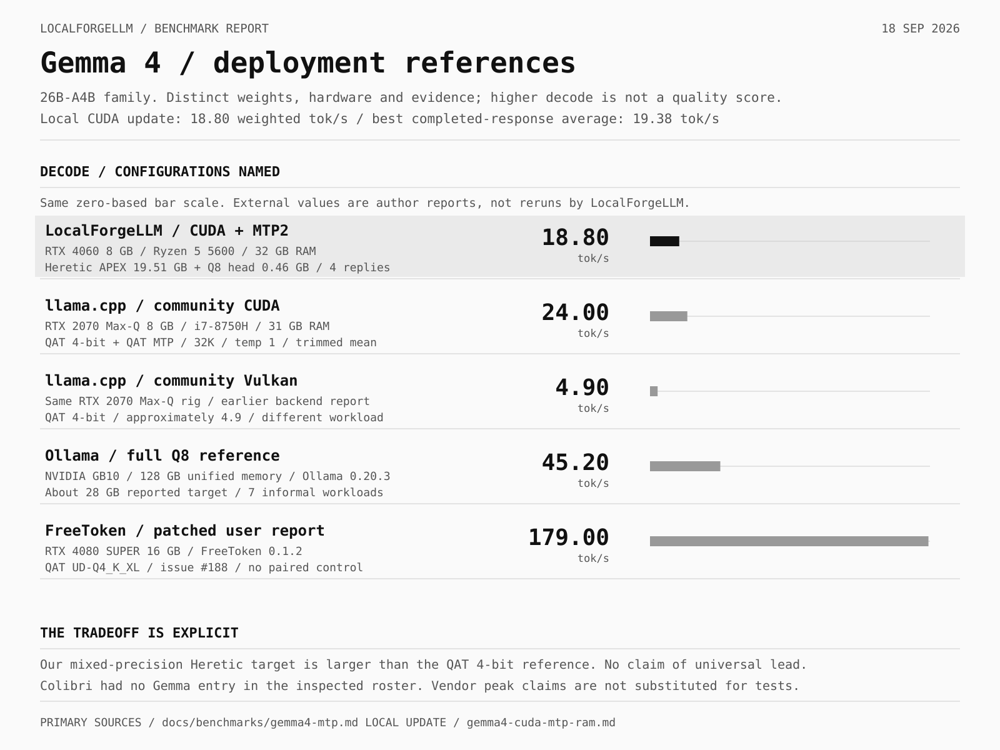
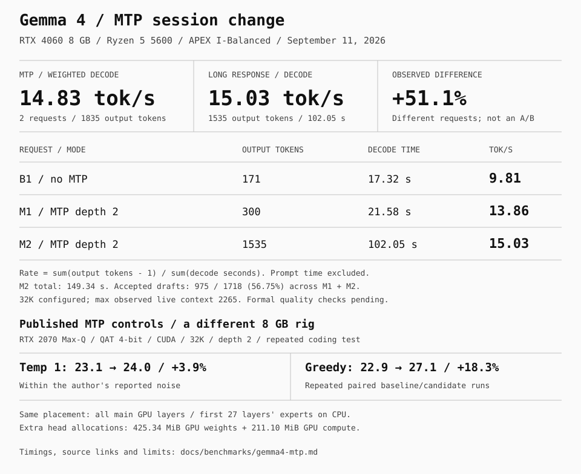

# LocalForgeLLM documentation

<p align="center">
  <strong>English</strong> · <a href="README.ru.md">Русский</a> · <a href="README.zh-CN.md">简体中文</a> · <a href="README.es.md">Español</a>
</p>

[Back to the project](../README.md) · [Install](#install) · [Launch profiles](#launch-profiles) · [Measurements](#measured-on-an-rtx-4060)

## Agent manual

Start with [AGENTS.md](../AGENTS.md) and the shared [LocalForgeLLM skill](../SKILL.md). The framework covers three LLM work levels: install an existing model and stack; tune or modify them; build a derived artifact from full weights. Updates and interface integration apply across the levels. Image, video and audio generation have a separate planned branch.

| Read when | Guide |
|:--|:--|
| Understand the framework and component ownership | [Architecture](architecture.md) |
| Interpret a task, discover an implementation or resume a stack | [Agent workflow and stack record](agent-workflow.md) |
| Install a published model and its dependencies | [Level 1 — install](llm/install.md) |
| Change context, placement, performance or MoE behavior | [Level 2 — tune and adapt](llm/tune.md) |
| Select, build, switch or compare CUDA and Vulkan | [Backend workflow and measured adaptation](implementations/engines.md#cuda-and-vulkan) |
| Download a matching head; enable, disable or diagnose speculative decoding | [MTP operations, memory and quality](implementations/mtp.md) |
| Convert/calibrate/quantize full weights | [Level 3 — build](llm/build.md) |
| Choose an engine or an optional weight-processing method | [Engines](implementations/engines.md) · [APEX](implementations/apex.md) |
| Connect or customize an agent/shell | [Interface contracts](interfaces/README.md) · [Pi](interfaces/pi.md) · [OpenShell](interfaces/openshell.md) · [llama UI](interfaces/llama-ui.md) · [Hermes](interfaces/hermes.md) |
| Update, repair or roll back a working stack | [Operations](operations.md) |
| Establish capability, quality and resource use | [Validation](validation.md) |
| Work on the future generative branch | [Planned scope](generative/README.md) |
| Check versions and the evidence behind a guide | [Sources](sources.md) |

The technical guides are maintained in English. The four language entry pages preserve the translated deployment examples below. Source-inspected configuration is distinguished from measured deployment results in [verification scope](sources.md#existing-measured-stack).

## How it works

1. Give your coding agent the task, target context and memory budget. Specify a MoE model or let it choose one. It inspects the CPU, GPU, RAM, storage and installed software.
2. Using the framework, model and runtime documentation, it selects a compatible engine and weight format.
3. It tunes CPU/GPU placement, threads, context, cache precision and batch sizes for your workload.
4. It runs the task, checks the output, measures speed and RAM/VRAM use, and refines the settings. The result is a reusable launch profile with its runtime version and parameters.


The installation and commands below are **two examples for one PC**, using Qwen and Gemma with APEX GGUF. The framework applies the same selection and tuning workflow to other MoE models and quantization methods.

## Install

**Reference hardware:** Linux x86_64, a Vulkan driver, RTX 4060 8 GB, Ryzen 5 5600 and 32 GB RAM. Reserve approximately 22 GB of SSD space for Gemma with vision, or 18 GB for Qwen. These are the tested configurations, not universal minimum requirements.

1. Download the [llama.cpp b10883 Vulkan archive](https://github.com/ggml-org/llama.cpp/releases/download/b10883/llama-b10883-bin-ubuntu-vulkan-x64.tar.gz) and extract it into `runtime/`.
2. Create `models/` and download one profile below. Keep the original filenames; the vision projector is `mmproj.gguf`.
3. Start the selected profile, then open [localhost:8080](http://localhost:8080). Agent clients use `http://127.0.0.1:8080/v1`, with model ID `gemma-apex` or `qwen-apex`. Run one model at a time.

| Profile | Downloads |
|:--|:--|
| Gemma 4 26B-A4B Heretic · **I-Balanced** | [Model · 19.51 GB](https://huggingface.co/mudler/gemma-4-26B-A4B-it-heretic-APEX-GGUF/resolve/8e3506b8b11a8ac2d666e0df473fa7ba4ec21497/gemma-4-26B-A4B-heretic-APEX-I-Balanced.gguf?download=true) + [vision · 1.19 GB](https://huggingface.co/mudler/gemma-4-26B-A4B-it-heretic-APEX-GGUF/resolve/8e3506b8b11a8ac2d666e0df473fa7ba4ec21497/mmproj.gguf?download=true) |
| Qwen3.6 35B-A3B · **I-Compact** | [Model · 17.29 GB](https://huggingface.co/mudler/Qwen3.6-35B-A3B-APEX-GGUF/resolve/316efc983b0d8d41290ceb4ad31bd9a66b6c54e8/Qwen3.6-35B-A3B-APEX-I-Compact.gguf?download=true) · text profile |

## Launch profiles

Run from the directory containing `runtime/` and `models/`. The archive creates `runtime/llama-b10883/`. `Vulkan0` is the RTX 4060 in our setup; adapt it if your device order differs.

### Gemma

Requires a systemd user session. The 11 GiB service limit includes file cache; `mmap` allows model pages to be reclaimed and read from SSD again. This limits resident memory at the cost of possible I/O stalls. It does not reserve memory for other applications or guarantee against OOM.

```bash
mkdir -p logs
systemd-run --user --unit=gemma-apex --collect \
  --property=MemoryMax=11G --property=MemorySwapMax=0 \
  --property=OOMPolicy=kill --property=OOMScoreAdjust=1000 \
  --property=LimitCORE=0 --property=CPUQuota=600% \
  --property=Nice=5 --property=TimeoutStopSec=15 \
  --property="StandardOutput=append:$PWD/logs/gemma-server.log" \
  --property=StandardError=inherit \
  "$PWD/runtime/llama-b10883/llama-server" \
  --model "$PWD/models/gemma-4-26B-A4B-heretic-APEX-I-Balanced.gguf" \
  --mmproj "$PWD/models/mmproj.gguf" \
  --no-mmproj-offload --image-max-tokens 1120 \
  --alias gemma-apex --host 127.0.0.1 --port 8080 --cors-origins localhost \
  --device Vulkan0 --gpu-layers all --n-cpu-moe 27 --fit off \
  --load-mode mmap --threads 6 --threads-batch 6 \
  --ctx-size 32768 --parallel 1 --batch-size 1152 --ubatch-size 1152 \
  --flash-attn on --cache-type-k q8_0 --cache-type-v q8_0 \
  --cache-ram 0 --ctx-checkpoints 1 \
  --temp 1.0 --top-p 0.95 --top-k 64 --min-p 0 \
  --log-colors off --log-timestamps
```

Stop with `systemctl --user stop gemma-apex`. The projector runs on the CPU. Keep the 1152 batch sizes with the 1120 image-token limit: smaller microbatches caused an image-processing assertion in this build.

For the optional MTP trial, follow the [verified 0.46 GB head download](implementations/mtp.md#download-a-compatible-head) and [Gemma MTP settings](implementations/mtp.md#gemma-trial-settings). Add those options to a candidate copy of this command, retaining the main placement and context. Disable by restoring this original command through the same service manager. The target remains APEX I-Balanced; the separate head is Q8_0.

### Qwen

Runs in the foreground; stop with `Ctrl+C`. This profile has no service memory limit or vision projector.

```bash
./runtime/llama-b10883/llama-server \
  --model ./models/Qwen3.6-35B-A3B-APEX-I-Compact.gguf \
  --alias qwen-apex --host 127.0.0.1 --port 8080 --cors-origins localhost \
  --device Vulkan0 --gpu-layers all --n-cpu-moe 36 --fit off \
  --load-mode none --threads 6 --threads-batch 6 \
  --ctx-size 32768 --parallel 1 --batch-size 512 --ubatch-size 128 \
  --flash-attn on --cache-type-k q8_0 --cache-type-v q8_0 \
  --cache-ram 0 --ctx-checkpoints 4 \
  --temp 1.0 --top-p 0.95 --top-k 20 --min-p 0 \
  --log-colors off --log-timestamps
```

## APEX example

These profiles use [APEX](https://github.com/localai-org/apex-quant) mixed-precision GGUF weights. It assigns precision by tensor role and layer; `I-` profiles use importance-matrix calibration. MoE activates a subset of experts per token, while llama.cpp splits execution between CPU and GPU. The complete model spans SSD, RAM and VRAM.

## Measured on an RTX 4060

Ryzen 5 5600 · 32 GB RAM · Manjaro Linux · llama.cpp b10883 / Vulkan · September 10–11, 2026.

| Model / profile | Decode | Context window | RAM / model VRAM |
|:--|--:|--:|:--|
| Qwen3.6 35B-A3B · I-Compact | **21.11 tok/s** | **32,768** | 13.43 GiB peak RSS / 4.07 GiB |
| Gemma 4 26B-A4B Heretic · I-Balanced + vision | **9.78 tok/s** | **32,768** | 11 GiB service limit / 4.88 GiB snapshot |
| Gemma 4, same target + Q8 MTP head (September 11) | **14.83 tok/s** | **32,768** | 11 GiB service limit / [startup allocations](benchmarks/gemma4-mtp.md#resource-accounting) |

September 10: Qwen had 28 completed requests, 19.37–22.09 tok/s, up to 29,087 reported context tokens; Gemma had one completed request with vision enabled, 599 input / 632 output tokens. September 11: Gemma MTP had two requests with final timings, 1835 logged output tokens and at most 2265 live context tokens; MTP vision quality was not tested. A configured 32K window is not a full-window stress test; decode rates exclude prompt processing.

## Resource use and methodology

Qwen resource monitoring covers 314 samples over the first 10 min 44 s of the session, including pauses:

| Resource | Average / maximum |
|:--|:--|
| Model RAM, RSS | 13.23 / 13.43 GiB |
| Model VRAM | 4.07 / 4.07 GiB |
| Model CPU, normalized to all 12 logical threads | 10.1% / 46.9% |
| Whole-GPU utilization, including desktop applications | 89.8% / 100% |
| GPU temperature | 50.4 / 54 °C |

Available system RAM fell to 2.53 GiB; free VRAM to 811 MiB. Gemma reached its 11 GiB cgroup ceiling, which includes file cache and is not the same measure as RSS. Its 4.88 GiB VRAM value is a snapshot; CPU/GPU utilization was not recorded for that profile.

Qwen generated 7,820 tokens across 28 completed requests. Weighted decode is `(7820 − 28) / 369.07315 = 21.11 tok/s`, following llama.cpp's first-token accounting. New-prompt processing averaged 67.36 tok/s. Gemma spent 97.59 s processing the prompt and 64.55 s decoding: 162.13 s total. These measurements describe serving speed, not a model-quality evaluation.

## Comparison with Colibri and FreeToken


- **[Colibri](https://github.com/JustVugg/colibri/blob/main/docs/qwen36-cuda-tier.md):** authors report 9.2 / 9.9 tok/s cold / warm, 40 GB peak RSS, Threadripper 3945WX + RTX 3070 8 GB, int4, 200-token decode.
- **[FreeToken](https://arxiv.org/html/2608.16157v1#S5):** authors report 39.3 tok/s on RTX 4060 Laptop 8 GB + i9-13900H, 32 GiB LPDDR5, NVFP4, OpenCode coding workload. Installed RAM is not measured process consumption.

Our Qwen rate is **2.13×** Colibri's cited warm rate and **46.3% below** FreeToken's cited rate. The rows describe different CPUs, formats, workloads and averaging methods. For memory, our figure and Colibri's are process RSS; FreeToken's 32 GiB is installed capacity. Gemma's 11 GiB is a service limit including file cache. Keep these definitions when comparing configurations.

## Gemma 4 and MTP comparisons





The September 11 no-MTP request measured 9.81 tok/s; two different MTP requests averaged 14.83 tok/s. The longer response sustained 15.03 tok/s during decode, but also took 47.29 s to process its new prompt. Main offload, CPU expert placement and the 32K allocation stayed fixed. Different requests and cache state prevent treating the +51.1% gap as causal MTP uplift. Formal quality checks remain pending.

The [case study](benchmarks/gemma4-mtp.md) includes full-Q8 and QAT alternatives, the external measurements' methods, Colibri's missing Gemma result, FreeToken's modality limits and the [sanitized timing data](benchmarks/gemma4-mtp.csv). Follow [MTP operations](implementations/mtp.md) for artifact discovery, verified downloads, switching and rollback.

The later [CUDA, MTP and RAM adaptation](benchmarks/gemma4-cuda-mtp-ram.md) adds an English infographic and 19 sanitized timing records across eight phases. CUDA + MTP with a 20 GiB cap averaged 18.80 tok/s across four responses; the initial backend switch alone did not improve the observed rate. The report separates runtime compilation time from total setup time. Use the [backend workflow](implementations/engines.md#cuda-and-vulkan) to apply and test these choices on another stack.
