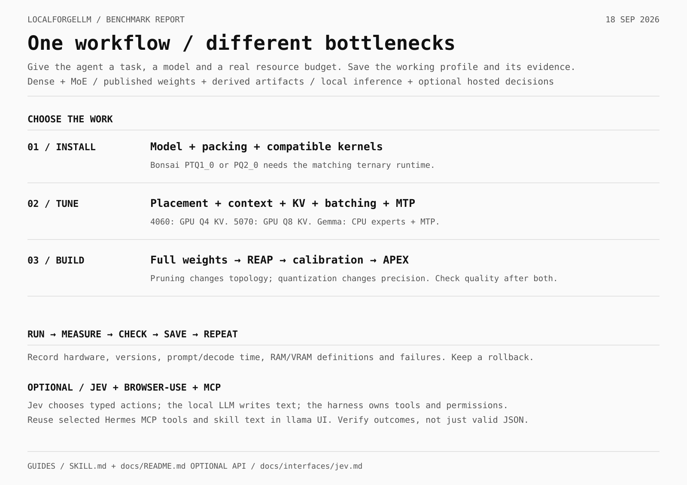
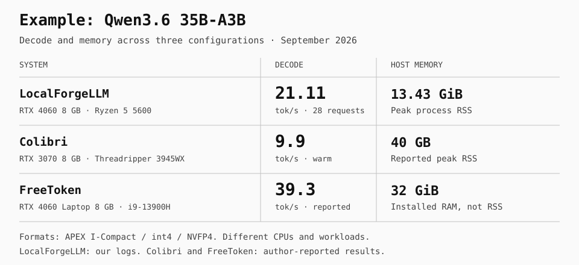

# Документация LocalForgeLLM

<p align="center">
  <a href="README.md">English</a> · <strong>Русский</strong> · <a href="README.zh-CN.md">简体中文</a> · <a href="README.es.md">Español</a>
</p>

[К проекту](../README.ru.md) · [Установка](#установка) · [Профили запуска](#профили-запуска) · [Замеры](#замеры-на-rtx-4060)

## Как это работает

1. Укажите кодинг-агенту задачу, нужный контекст и бюджет памяти. Задайте MoE-модель или доверьте ему выбор. Он изучает CPU, GPU, RAM, накопитель и установленное ПО.
2. По документации фреймворка, модели и движка выбирает совместимый движок и формат весов.
3. Подбирает распределение CPU/GPU, потоки, контекст, точность кеша и размеры батчей под вашу задачу.
4. Запускает задачу, проверяет ответ, измеряет скорость и потребление RAM/VRAM, затем уточняет настройки. Результат — готовый профиль запуска с версией движка и параметрами.



Установка и команды ниже — **два примера для одного ПК**: Qwen и Gemma с APEX GGUF. Тот же цикл выбора и настройки фреймворк применяет к другим MoE-моделям и методам квантования.

## Установка

**Проверенное железо:** Linux x86_64, драйвер Vulkan, RTX 4060 8 ГБ, Ryzen 5 5600 и 32 ГБ RAM. Выделите примерно 22 ГБ на SSD для Gemma со зрением или 18 ГБ для Qwen. Это проверенные конфигурации, а не универсальные минимальные требования.

1. Скачайте [архив llama.cpp b10883 с Vulkan](https://github.com/ggml-org/llama.cpp/releases/download/b10883/llama-b10883-bin-ubuntu-vulkan-x64.tar.gz) и распакуйте его в `runtime/`.
2. Создайте `models/` и скачайте один из профилей ниже. Сохраните исходные имена файлов; проектор зрения называется `mmproj.gguf`.
3. Запустите выбранный профиль и откройте [localhost:8080](http://localhost:8080). Для агентов используйте `http://127.0.0.1:8080/v1` и идентификатор модели `gemma-apex` или `qwen-apex`. Запускайте одну модель за раз.

| Профиль | Файлы |
|:--|:--|
| Gemma 4 26B-A4B Heretic · **I-Balanced** | [Модель · 19.51 ГБ](https://huggingface.co/mudler/gemma-4-26B-A4B-it-heretic-APEX-GGUF/resolve/8e3506b8b11a8ac2d666e0df473fa7ba4ec21497/gemma-4-26B-A4B-heretic-APEX-I-Balanced.gguf?download=true) + [зрение · 1.19 ГБ](https://huggingface.co/mudler/gemma-4-26B-A4B-it-heretic-APEX-GGUF/resolve/8e3506b8b11a8ac2d666e0df473fa7ba4ec21497/mmproj.gguf?download=true) |
| Qwen3.6 35B-A3B · **I-Compact** | [Модель · 17.29 ГБ](https://huggingface.co/mudler/Qwen3.6-35B-A3B-APEX-GGUF/resolve/316efc983b0d8d41290ceb4ad31bd9a66b6c54e8/Qwen3.6-35B-A3B-APEX-I-Compact.gguf?download=true) · текстовый профиль |

## Профили запуска

Выполняйте команды из каталога с `runtime/` и `models/`. Архив создаёт `runtime/llama-b10883/`. В нашей конфигурации `Vulkan0` — RTX 4060; при другом порядке устройств измените это значение.

### Gemma

Нужна пользовательская сессия systemd. Лимит службы 11 ГиБ включает файловый кеш; `mmap` позволяет освобождать страницы модели и повторно читать их с SSD. Это ограничивает резидентную память ценой возможных задержек ввода-вывода. Лимит не резервирует память для других приложений и не гарантирует защиту от OOM.

```bash
mkdir -p logs
systemd-run --user --unit=gemma-apex --collect \
  --property=MemoryMax=11G --property=MemorySwapMax=0 \
  --property=OOMPolicy=kill --property=OOMScoreAdjust=1000 \
  --property=LimitCORE=0 --property=CPUQuota=600% \
  --property=Nice=5 --property=TimeoutStopSec=15 \
  --property="StandardOutput=append:$PWD/logs/gemma-server.log" \
  --property=StandardError=inherit \
  "$PWD/runtime/llama-b10883/llama-server" \
  --model "$PWD/models/gemma-4-26B-A4B-heretic-APEX-I-Balanced.gguf" \
  --mmproj "$PWD/models/mmproj.gguf" \
  --no-mmproj-offload --image-max-tokens 1120 \
  --alias gemma-apex --host 127.0.0.1 --port 8080 --cors-origins localhost \
  --device Vulkan0 --gpu-layers all --n-cpu-moe 27 --fit off \
  --load-mode mmap --threads 6 --threads-batch 6 \
  --ctx-size 32768 --parallel 1 --batch-size 1152 --ubatch-size 1152 \
  --flash-attn on --cache-type-k q8_0 --cache-type-v q8_0 \
  --cache-ram 0 --ctx-checkpoints 1 \
  --temp 1.0 --top-p 0.95 --top-k 64 --min-p 0 \
  --log-colors off --log-timestamps
```

Остановка: `systemctl --user stop gemma-apex`. Проектор работает на CPU. Сохраняйте размеры батчей 1152 при лимите 1120 токенов изображения: меньший микробатч вызывал ошибку assertion при обработке изображений в этой сборке.

### Qwen

Работает в текущем терминале; остановка — `Ctrl+C`. В этом профиле нет лимита памяти службы и проектора зрения.

```bash
./runtime/llama-b10883/llama-server \
  --model ./models/Qwen3.6-35B-A3B-APEX-I-Compact.gguf \
  --alias qwen-apex --host 127.0.0.1 --port 8080 --cors-origins localhost \
  --device Vulkan0 --gpu-layers all --n-cpu-moe 36 --fit off \
  --load-mode none --threads 6 --threads-batch 6 \
  --ctx-size 32768 --parallel 1 --batch-size 512 --ubatch-size 128 \
  --flash-attn on --cache-type-k q8_0 --cache-type-v q8_0 \
  --cache-ram 0 --ctx-checkpoints 4 \
  --temp 1.0 --top-p 0.95 --top-k 20 --min-p 0 \
  --log-colors off --log-timestamps
```

## Пример с APEX

Эти профили используют GGUF-веса со смешанной точностью [APEX](https://github.com/localai-org/apex-quant). Точность назначается по роли тензора и слою; профили `I-` используют калибровку по матрице важности. MoE активирует часть экспертов для каждого токена, а llama.cpp распределяет вычисления между CPU и GPU. Полная модель размещается совместно на SSD, в RAM и VRAM.

## Замеры на RTX 4060

Ryzen 5 5600 · 32 ГБ RAM · Manjaro Linux · llama.cpp b10883 / Vulkan · 10 сентября 2026 года.

| Модель / профиль | Генерация | Окно контекста | RAM / VRAM модели |
|:--|--:|--:|:--|
| Qwen3.6 35B-A3B · I-Compact | **21.11 токена/с** | **32,768** | пик RSS 13.43 ГиБ / 4.07 ГиБ |
| Gemma 4 26B-A4B Heretic · I-Balanced + зрение | **9.78 токена/с** | **32,768** | лимит службы 11 ГиБ / снимок 4.88 ГиБ |

Qwen: 28 завершённых запросов, 19.37–22.09 токена/с, до 29,087 токенов контекста по отчётам. Gemma: один завершённый запрос с подключённым зрением, 599 входных / 632 выходных токена. Настроенное окно 32K не означает стресс-тест с заполненным контекстом; скорость генерации не включает обработку промпта.

## Нагрузка на ПК и методика

Мониторинг ресурсов Qwen охватывает 314 замеров за первые 10 мин 44 с сессии, включая паузы:

| Ресурс | Среднее / максимум |
|:--|:--|
| RAM модели, RSS | 13.23 / 13.43 ГиБ |
| VRAM модели | 4.07 / 4.07 ГиБ |
| CPU модели, доля всех 12 логических потоков | 10.1% / 46.9% |
| Загрузка всей GPU, включая приложения рабочего стола | 89.8% / 100% |
| Температура GPU | 50.4 / 54 °C |

Доступная системная RAM снижалась до 2.53 ГиБ, свободная VRAM — до 811 МиБ. Gemma достигла лимита cgroup 11 ГиБ, который включает файловый кеш и отличается от RSS. Её 4.88 ГиБ VRAM — отдельный снимок; загрузка CPU/GPU для этого профиля не записывалась.

Qwen сгенерировал 7,820 токенов за 28 завершённых запросов. Средняя по времени скорость генерации: `(7820 − 28) / 369.07315 = 21.11 токена/с`, с учётом первого токена по методике llama.cpp. Средняя скорость обработки нового входа — 67.36 токена/с. Gemma потратила 97.59 с на обработку промпта и 64.55 с на генерацию: всего 162.13 с. Эти замеры описывают скорость обслуживания запросов, а не качество модели.

## Сравнение с Colibri и FreeToken



- **[Colibri](https://github.com/JustVugg/colibri/blob/main/docs/qwen36-cuda-tier.md):** авторы приводят 9.2 / 9.9 токена/с с холодной / прогретой историей маршрутизации, пик RSS 40 GB, Threadripper 3945WX + RTX 3070 8 ГБ, int4, генерация 200 токенов.
- **[FreeToken](https://arxiv.org/html/2608.16157v1#S5):** авторы приводят 39.3 токена/с на RTX 4060 Laptop 8 ГБ + i9-13900H, 32 ГиБ LPDDR5, NVFP4, кодинг-задача через OpenCode. Объём установленной RAM не является замером потребления процесса.

Наша скорость Qwen — **2.13×** от приведённой прогретой скорости Colibri и **на 46.3% ниже** приведённой скорости FreeToken. Строки описывают разные CPU, форматы, задачи и способы усреднения. Показатели памяти у нас и у Colibri — RSS процесса; 32 ГиБ у FreeToken — установленная ёмкость. 11 ГиБ у Gemma — лимит службы, включающий файловый кеш. Учитывайте эти определения при сравнении конфигураций.
