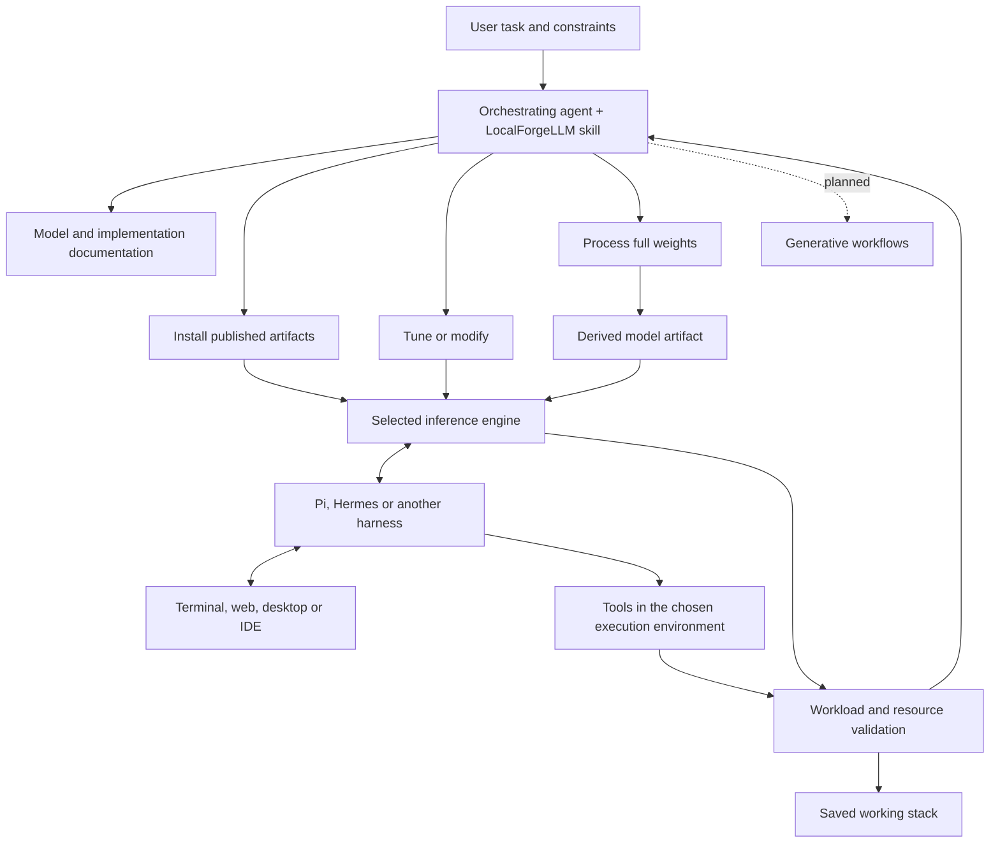

# Framework architecture

[Documentation](README.md) · [Agent skill](../SKILL.md)

LocalForgeLLM provides the operating instructions, implementation knowledge and validation procedures an agent needs to assemble and maintain a local AI stack. Its durable output is the user's working stack and its reproducible record. Models, quantizers, inference engines and harnesses remain interchangeable according to compatibility and the task.

## Domains and levels

| Domain | Level | Work |
|:--|:--|:--|
| LLM | 1 — install | Select/download an existing model; install the engine, backend and dependencies; connect the client |
| LLM | 2 — adapt | Tune launch and request parameters; where supported, change model behavior, routing or internals and evaluate the effect |
| LLM | 3 — build | Start from full weights and create a derived artifact with conversion, calibration, quantization or another existing weight-processing implementation |
| Generative models | Planned | Image, video and audio generation; [reserved entry](generative/README.md) |

These are routes, not an installation wizard. Updating a dependency is an operations task. Connecting Hermes to an existing endpoint is an interface task. Neither needs to repeat all three levels.

Vision input to an LLM belongs to the LLM branch. Generating an image, video or audio artifact belongs to the planned generative branch. Level 3 does not imply pretraining a model from random weights.

## Ownership

| Component | Owns | Saved evidence |
|:--|:--|:--|
| Orchestrating agent | Task interpretation, discovery, implementation choice, edits and checks | Request, decisions, source references, work status |
| Model artifact | Architecture, tokenizer, chat template, tensors, quantization, optional projector/adapters | Repository revision, filenames, checksums, build recipe |
| Inference engine | Weight loading, kernels, devices, memory, batching, server API | Binary/build identity, dependencies, effective launch parameters |
| Agent harness | Prompt assembly, history, compaction, tool calls, retries and sessions | Provider config, capability settings, tool permissions |
| Execution environment | Where the harness and its tools run; filesystem/network/process access | Host/container identity, workspace, policy and service configuration |
| Interface | Terminal, web, desktop, IDE or messaging interaction | Connection settings and any extension/patch |

OpenShell can contain the harness while inference runs on the host or another machine. It does not have to contain the model. A web chat may talk directly to inference; an autonomous coding client also needs an agent loop and a tool executor.

## Implementation boundaries

An APEX GGUF can be served by a compatible llama.cpp build. FreeToken's execution and cache mechanisms belong to FreeToken; using them means selecting its supported checkpoint path and runtime. An OpenAI-compatible HTTP API connects clients to engines but does not make their weights, command-line flags, reasoning formats or tools interchangeable.

Extend the framework with an implementation note and a verified task procedure. Add executable helpers only when native tools leave a repeated, concrete gap. Do not require a new plugin ABI, registry service or custom inference daemon merely to support another engine.

Read [the workflow](agent-workflow.md) for the stack record and [operations](operations.md) for updates and resumption.
