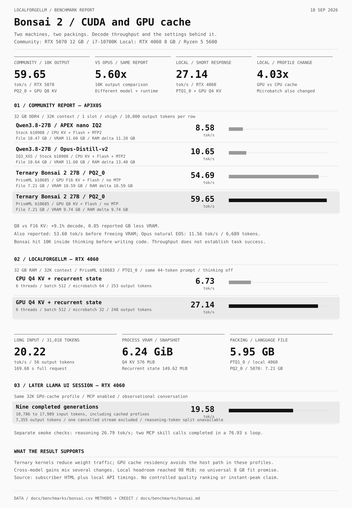

# Bonsai 2: RTX 4060 and community RTX 5070 results

[Documentation](../README.md) · [Launch and tuning recipe](../implementations/bonsai.md) · [CSV](bonsai.csv)

**September 18, 2026.** Community contributor **ap3x0s** supplied the RTX 5070 report. LocalForgeLLM's RTX 4060 checks are a separate dataset. The peak reported 10K-output run is **59.65 tok/s** on the 5070; our final short-response check is **27.14 tok/s** on the 4060. These are averages over decode intervals, not instantaneous peaks or a comparison of model intelligence.

## Community report: RTX 5070

Hardware: **RTX 5070 12 GB, Core i7-10700K, 32 GB DDR4**, PCIe 3.0 x16. All main comparison runs use 32,768 configured context, one slot, Flash Attention and `xhigh` thinking. The report names stock llama.cpp **b10908** for APEX/Opus and the PrismML fork **b10685** for Bonsai; exact commits are not supplied.

| Model / packing | Cache and speculation | Output tokens | Decode, tok/s | VRAM, reported GB | Host RAM delta, reported GB |
|:--|:--|--:|--:|--:|--:|
| Qwen3.8-27B APEX / nano IQ2, 10.47 GB | CPU KV, MTP depth 2 | 10,000 | 8.58 | 11.60 | 11.20 |
| Qwen3.8-27B Opus-Distill-v2 / IQ3_XXS, 10.64 GB | CPU KV, MTP depth 2 | 10,000 | 10.65 | 11.60 | 13.40 |
| Ternary Bonsai 2 27B / PQ2_0, 7.21 GB | GPU Q8 KV, no MTP | 10,000 | **59.65** | **9.74** | **9.74** |
| Ternary Bonsai 2 27B / PQ2_0, 7.21 GB | GPU F16 KV, no MTP | 10,000 | 54.69 | 10.59 | 10.59 |

The reported host metric is **system RAM after loading minus the pre-load baseline**. It is not process RSS, PSS, a service limit or VRAM. Units are retained as supplied; byte counters are unavailable. The source lists CUDA 13.2 together with `cudart64_12.dll`, an unresolved version-label discrepancy. No toolkit version is inferred from that combination.

Two additional runs belong outside the equal-output comparison:

- Bonsai Q8 KV before freeing background VRAM: **53.60 tok/s**, 10,000 output tokens; memory usage not supplied. The later 59.65 result is an observed **11.3%** difference, not an isolated background-process experiment.
- Opus stopped naturally at **6,689 tokens**, **11.56 tok/s**, 11.7 reported GB VRAM. The 10K Opus run used `ignore_eos` and an extended task. A longer forced continuation is not the same workload as a completed answer.

The task requested a binary search tree implementation, operations, complexity analysis and comparisons with other tree structures. Bonsai's 10K run exhausted its budget **inside thinking, before emitting the requested code**. Therefore 59.65 measures token throughput; it does not demonstrate successful completion or better coding quality. The report supplies aggregate numbers, not raw per-request timings, repetitions or a full prompt transcript.

## What explains the speed difference

Within the reported 10K rows, Bonsai Q8 is **5.60×** Opus and **6.95×** APEX. Recalculation gives **+460.1%** versus Opus; the supplied graphic's +461% is not reproduced by 59.65 / 10.65. Q8 versus F16 KV is **+9.1%**, with **0.85 reported GB** less VRAM. The PQ2 language file is **32.2% smaller** than the reported Opus file.

The plausible mechanism is less weight traffic with native ternary kernels and enough room to keep the cache on the GPU. Conventional rows put KV in host RAM. However, weights, quantization, runtime, cache placement, threads and MTP differ together. This report cannot allocate the 5.60× gap to any one change. GPU residency is a tuning target, not a universal guarantee of that multiplier.

## Our RTX 4060: move Q4 cache and recurrent state onto the GPU

Hardware: **RTX 4060 8 GB, Ryzen 5 5600, 32 GB RAM**, Linux. PrismML **b10683 / d8f26eec76da6d09bb708bcba51ef64b8cd868a3**, CUDA 13.3. Model: **PTQ1_0**, 5,946,648,928 bytes; separate Q8 vision projector on the CPU. Both profiles use 32K, one slot, all model layers on GPU, calibrated Q4 KV, Flash Attention, six threads, batch 512, disabled CUDA graphs and no MTP.

| Check | KV + recurrent state | Microbatch | Input / output tokens | Decode | Full request |
|:--|:--|--:|--:|--:|--:|
| Short RU response, baseline | CPU | 64 | 44 / 253 | 6.73 tok/s | 38.21 s |
| Same prompt, final GPU profile | GPU | 32 | 44 / 248 | **27.14 tok/s** | **9.59 s** |
| Long lookup, final GPU profile | GPU | 32 | 31,018 / 56 | **20.22 tok/s** | 169.68 s |

The short comparison is **4.03× decode**. Microbatch also changed and outputs differ, so it is a profile comparison, not a controlled cache-only result. Requests used temperature 0 and disabled thinking. The 31,018-token lookup processed input at **185.85 tok/s** and recovered all three planted values. It tests retrieval from repetitive filler, not general long-document reasoning. No extrapolation to the advertised 262K window is justified.

Local native timing uses `(output_tokens - 1) / (decode_ms / 1000)`; prompt time and end-to-end latency are separate CSV columns. One run per short profile and one long lookup do not establish a sustained minimum. Tiny arithmetic/tool responses are excluded from the headline to avoid promoting a handful of tokens as a throughput benchmark.

### Memory and capability checks

| Resource | Observed value | Definition |
|:--|--:|:--|
| CUDA model buffer | 5,395.33 MiB | Runtime allocation |
| Q4 KV | 576 MiB | 32K configured cache |
| Recurrent state | 149.62 MiB | GPU allocation, separate from KV |
| CUDA compute buffer | 135.89 MiB | Microbatch 32 |
| Whole model process VRAM | 6,386 MiB / 6.24 GiB | Snapshot after checks; includes other runtime allocations |
| Whole GPU used, sampled peak | 7,730 MiB | Includes desktop and other applications |
| Free GPU memory, sampled minimum | 98 MiB | Tight headroom on this desktop |
| Service charged memory, peak | 1,633,968,128 bytes / 1.52 GiB | Cgroup accounting; not RSS or the 20 GiB limit |
| Service swap | 0 | At the recorded check |

Samples were taken every two seconds, so these are sampled bounds. An earlier attempt failed to allocate recurrent state while background VRAM was higher. The profile subsequently loaded without closing user applications; an 8 GB card does not guarantee that it fits alongside every desktop workload.

Arithmetic, a real file-reading tool round trip, synthetic image OCR and the long lookup passed. The full check first exited nonzero because its reasoning assertion did not accept a correct LaTeX fraction. The original result was retained; the assertion was corrected and reasoning passed on rerun. This is a capability smoke test, not quality parity with the parent model.

## Interactive llama UI session: 32K on RTX 4060

The later user session used the same GPU-cache profile with MCP enabled. Its
[sanitized timing CSV](bonsai-session.csv) contains nine completed generations
and one explicitly cancelled stream. This is an observational conversation,
separate from the short-prompt tuning checks above.

| Metric | Recorded result |
|:--|:--|
| Completed output | 7,355 tokens across nine requests |
| Weighted decode | **19.58 tok/s** over 375.225 seconds of decode |
| Per-request decode | **18.21–22.32 tok/s**; median 20.10 |
| Input context | 10,786–17,989 tokens, including cached prefixes |
| Largest slot after generation | 20,334 tokens; no logged truncation |
| First uncached prefill | 10,786 tokens in 57.949 s / 186.13 tok/s |
| Service charged memory, peak | 1,704,890,368 bytes / 1.59 GiB; swap 0 at shutdown |

Weighted decode is `sum(output_tokens - 1) / sum(decode_seconds)`: **7,346 timed
tokens**, because each request's first generated token belongs to prefill in
this runtime. The cancelled stream has no final timing summary and is excluded
from token totals and speed aggregates. Blank CSV fields mean unavailable, not
zero. `prompt_evaluated_tokens` excludes reused prefixes; `input_tokens` includes
them. Neither decode time nor prompt-plus-decode time measures browser/tool
execution or the user's pauses.

The server log does not expose a reasoning/answer token split or complete tool
execution traces for this conversation. Those counts remain **unknown**. The
separate saved capability checks establish the following narrower results:

- **Reasoning:** a response with nonempty `reasoning_content`, 231 total output
  tokens, **26.79 tok/s** decode and **8.90 s** full request; the corrected answer
  assertion passed. The response does not report how many tokens belong to
  reasoning alone.
- **Native MCP:** **47 available tools**; the model selected
  `forge_skills_list`, then `forge_skill_view`, consumed their results and
  answered. Two tool calls across three model requests took **76.93 s** for the
  complete check, with 134 output tokens and input contexts of 11,051, 11,291
  and 12,529 tokens. This is one successful loop, not a tool-call accuracy rate.
- **Local browser text helper:** valid field-text JSON, 176 input / 17 output
  tokens in **1.865 s**. No browser was launched and no paid Jev request was made
  by these integration checks.

At the user's request the service was stopped after this session. The process
exited, its model VRAM was released and port 8081 had no listener. The shutdown
does not invalidate the saved profile or measurements.

## Provenance

- Subscriber source: `benchmark_report_all_models.html`, report dated September 18, credit **ap3x0s**, supplied directly by the user. SHA-256: `b29b1489a12786d0dffdfae0fb08957c55e26009f5d6284213788b12226322b3`. The six unique reported runs are transcribed in [CSV](bonsai.csv); repeated summary tables are not counted as additional trials.
- Local sources: the saved `checks-32k-cpu-kv.json`, `checks-32k-gpu-final.json`, `checks-32k-gpu-reasoning.json`, `resources-32k-gpu-final.json` and launch profiles from September 18. Published data contains numeric measurements only; private session payloads remain local.
- Interactive session: the final server instance's ten requests in `server.log`,
  SHA-256 `7e3fa43b45567ce6863257f8ba125b96938856b18247796d9035fea15d22960d`,
  plus shutdown cgroup counters. MCP/helper checks come from the separate
  `mcp-live-result.json` and `mcp-text-helper-result.json`. User prompts, answers,
  reasoning text, conversation IDs, tool arguments and credentials are omitted.
- Weights and packing: [pinned PrismML model card](https://huggingface.co/prism-ml/Ternary-Bonsai-2-27B-gguf/blob/6ed5e12bf84b7a63069882c91dd9e9218647d17b/README.md), [runtime](https://github.com/PrismML-Eng/llama.cpp/tree/d8f26eec76da6d09bb708bcba51ef64b8cd868a3), [upstream deployment guide](https://github.com/PrismML-Eng/Bonsai-demo).

PTQ1_0 and PQ2_0 are different packings of the ternary representation: **5.95 and 7.21 GB**, respectively. The source's ideal 1.72 bits/weight must not be confused with the PQ2 container's 2.13 bits/weight. We did not rerun vendor quality benchmarks or compare Bonsai against commercial chat models.
