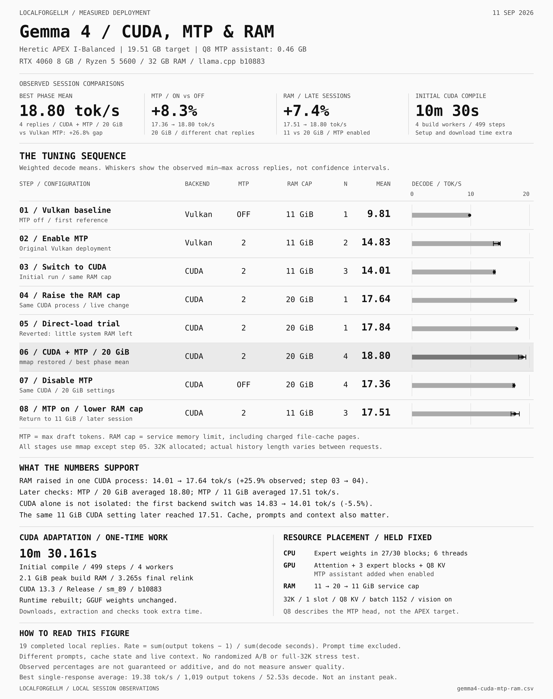

# Gemma 4: CUDA, MTP and RAM adaptation

English infographic based on 19 completed local responses recorded on September 11, 2026.



[Editable SVG](../assets/gemma4-cuda-mtp-ram.svg) · [Per-response timing data](gemma4-cuda-mtp-ram.csv)

## Hardware and fixed settings

- RTX 4060 8 GB; Ryzen 5 5600; 32 GB installed RAM.
- Gemma 4 26B-A4B Heretic APEX I-Balanced: 19,508,269,920 bytes (19.51 GB).
- Separate non-QAT Q8 MTP assistant: 461,766,816 bytes (0.46 GB). Q8 does not describe the main model.
- CPU vision projector: 1,194,828,384 bytes (1.19 GB); image understanding is enabled but not tested here.
- llama.cpp b10883, commit `91f6a6cf361385700bbe15981f0f39909df77498` for both backends.
- 32,768 context allocation; one slot; six CPU threads; batch/ubatch 1152; Q8 K/V; flash attention on.
- Main GPU layers: all; expert weights in the first 27 of 30 blocks placed on CPU; automatic fitting off.
- MTP on means draft depth 2, confidence cutoff 0 and Q8 draft K/V.

## Chronological phase table

| Step | Configuration | Backend | MTP depth | RAM cap | Load mode | Replies | Weighted decode, tok/s | Observed range, tok/s |
|---|---|---|---:|---:|---|---:|---:|---:|
| 01 | Vulkan baseline | Vulkan | 0 | 11 GiB | mmap | 1 | 9.81 | 9.81–9.81 |
| 02 | Enable MTP | Vulkan | 2 | 11 GiB | mmap | 2 | 14.83 | 13.86–15.03 |
| 03 | Switch to CUDA | CUDA | 2 | 11 GiB | mmap | 3 | 14.01 | 13.93–14.14 |
| 04 | Raise the RAM cap | CUDA | 2 | 20 GiB | mmap | 1 | 17.64 | 17.64–17.64 |
| 05 | Direct-load trial | CUDA | 2 | 20 GiB | none | 1 | 17.84 | 17.84–17.84 |
| 06 | CUDA + MTP / 20 GiB | CUDA | 2 | 20 GiB | mmap | 4 | 18.80 | 18.14–19.38 |
| 07 | Disable MTP | CUDA | 0 | 20 GiB | mmap | 4 | 17.36 | 17.20–17.44 |
| 08 | MTP on / lower RAM cap | CUDA | 2 | 11 GiB | mmap | 3 | 17.51 | 16.86–18.28 |

## Observed contrasts

- MTP at 20 GiB (06 vs 07): 17.36 → 18.80 tok/s; +8.3%. Four responses in each phase.
- Late RAM-cap sessions with MTP (06 vs 08): 17.51 → 18.80 tok/s; +7.4% for 20 GiB versus 11 GiB. Chronologically, the cap was lowered at step 08.
- Initial RAM-cap increase in the same running CUDA process (03 to 04): +25.9%. Step 04 is only one response and can also reflect warmed caches or workload differences.
- First backend switch (02 to 03): -5.5%; a CUDA-only improvement was not established.
- Vulkan + MTP at 11 GiB versus CUDA + MTP at 20 GiB (02 vs 06): +26.8% combined session gap. Backend and memory cap differ, so the contributions cannot be separated.
- Step 05 disabled mmap temporarily. It was reverted because global available RAM fell below 1 GiB; its speed is not blended into the mmap phase.
- The same CUDA/MTP/11-GiB settings averaged 14.01 initially and 17.51 later. This demonstrates why configuration labels alone do not isolate cache, context and workload effects.

## CUDA adaptation time

| Item | Recorded result |
|---|---|
| Initial compile | 10 min 30.161 s wall time; 499 Ninja steps |
| Build resources | Four build workers; 2.1 GiB peak build memory; no swap |
| Aggregate CPU time during initial compile | 41 min 11.148 s; not wall-clock elapsed time |
| Runtime-library path correction | 3.265 s incremental relink |
| Additional work | Toolkit/compiler download, signature/hash checks, extraction, configuration and validation; full end-to-end time was not captured |
| What changed | llama.cpp runtime rebuilt with CUDA 13.3, Release, architecture sm_89; existing GGUF weights were reused |

The CUDA transition did not train, convert or requantize Gemma. Compilation time is not total setup time.

## Calculation and evidence limits

The b10883 native decode timer excludes the first output token. Phase throughput is therefore:

```text
sum(logged output tokens - 1) / sum(decode milliseconds / 1000)
```

Whiskers are the minimum and maximum completed-response decode rates within a phase. They are not standard errors or confidence intervals. Draft-accepted tokens are already part of output and are not counted a second time.

This is descriptive session evidence, not a randomized, paired benchmark. Prompts, actual context fill, cache state, request lengths and desktop load vary. Percentages are not additive, transferable to other hardware or guaranteed on another task. The 32K setting is an allocation, not evidence of a full-window benchmark. No formal quality score is reported. The Vulkan no-MTP reference contains only one short response.

The RAM column is the service limit, not measured resident memory. File-cache charging and available system memory can affect the behavior of a memory-mapped model.

Sources: completed native timing lines from the local `gemma-server.log`; the recorded CUDA compilation metrics in `changes.md`; build output in `build.log`; the pinned b10883 source. No new inference requests were sent to produce this infographic.

The local log was frozen at byte 387029; SHA-256 of that prefix: `b7ea84ef185847bbfa0f4067a57229bf22cd99eef8f1dd54713057c3bf4ed476`. Only numerical timing records are included in the CSV; prompts, personal paths and chat content are excluded.

Initial CUDA task IDs 0, 82 and 613 belong to the 11-GiB phase; task 1108 belongs to the live 20-GiB phase. The last phase starts at byte 331940. Phase boundaries were checked against the service changes in the session.
