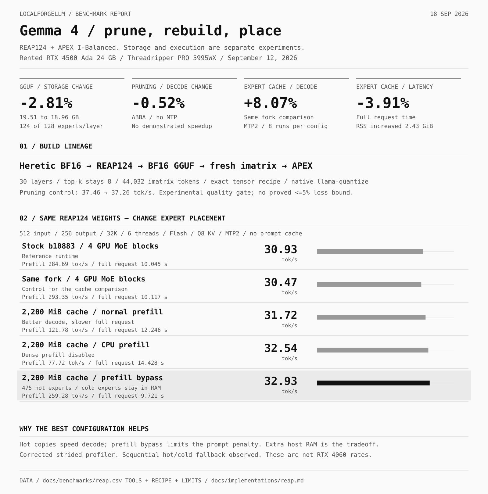

# REAP, APEX rebuilds and expert caching

[Level 3 — build](../llm/build.md) · [APEX](apex.md) · [Numeric results](../benchmarks/reap.csv)

**Recorded experiment: September 12, 2026.** We pruned Gemma 4 Heretic full weights on a rented **RTX 4500 Ada 24 GB / Threadripper PRO 5995WX** machine, exported a new GGUF, calibrated it and rebuilt the APEX precision allocation. A later experiment cached individual experts on the GPU. These are three different operations; the measured outcomes must stay separate.



## Tools and artifact lineage

| Stage | Tool / pinned source | What we actually used |
|:--|:--|:--|
| Full weights | [coder3101/gemma-4-26B-A4B-it-heretic](https://huggingface.co/coder3101/gemma-4-26B-A4B-it-heretic/tree/e6d09d5c434a5e91326ce9d779786a91e7aaae35) | Already Heretic-modified BF16; no second ablation |
| Expert ranking | [Cerebras REAP, 1970473](https://github.com/CerebrasResearch/reap/tree/1970473c51ca3caeb98c10392f15b3a08a672974) | Native `reap.pruning_metrics` plus a local Gemma 4 observer/export adapter |
| Full-weight execution | PyTorch 2.7.1+cu126, Transformers 5.17.0 | CPU/GPU dispatch, native Gemma forward, load/export checks |
| Conversion | [llama.cpp b10883 / 91f6a6cf](https://github.com/ggml-org/llama.cpp/tree/91f6a6cf361385700bbe15981f0f39909df77498) | `convert_hf_to_gguf.py --outtype bf16 --fuse-gate-up-exps` |
| Calibration | Same checkout's `llama-imatrix` | New matrix for the changed 124-expert topology |
| Quantization | Same checkout's `llama-quantize` | Exact tensor-type file matching the published I-Balanced allocation; Q5_K_M fallback; 1024 MiB buffer limit |
| Calibration source | [eaddario/imatrix-calibration, e87ed55](https://huggingface.co/datasets/eaddario/imatrix-calibration/tree/e87ed55dcba9d9c3a3e41539f3e728e981b1daa4) | RU/EN, code and tools; held-out lines separated by hash |
| Placement experiment | [adrianhoehne/llama.cpp, 018789c](https://github.com/adrianhoehne/llama.cpp/tree/018789cb57128ab67bc0bdbda59ae99f4df3f046) | Static hot-expert cache, a local stride-reader correction and its regression check |

The complete lineage was **Heretic BF16 → REAP124 BF16 → BF16 GGUF → new imatrix → APEX I-Balanced GGUF**. APEX selects tensor precision; REAP changes which experts exist; caching changes where retained weights execute. None of these is training a new base model.

## REAP compatibility and pruning procedure

The inspected REAP revision did **not** implement Gemma 4. Its generic CLI alone cannot reproduce this experiment. Our adapter observed the native router, calculated expert output norms with Gemma's `per_expert_scale`, and imported the REAP metric unchanged. It then sliced the fused expert tensors, router projection and expert scales consistently. The adapter and full task corpus remain in the local experiment record; this guide is the verified procedure, not a bundled generic pruning CLI.

1. Pin the parent and validate shard hashes, tokenizer, chat template and architecture.
2. Inspect REAP's model support. Use an architecture adapter only after checking the actual tensor layout and forward path. Do not assume a related MoE family shares Gemma's fused tensors.
3. Collect router-weighted output-norm statistics on representative calibration inputs. Our pilot used 26 RU/EN dialogs, 3,138 tokens per layer. Experts without observations were protected from removal.
4. Remove **four of 128 experts in each of 30 layers**, retain original ordering and leave **top-k = 8** unchanged. Preserve the source and export to a new directory.
5. Check observer/no-observer and zero-pruning logits for exact agreement, compare the metric with an independent formula, verify retained tensor slices and reload through ordinary Transformers.
6. Evaluate on separate tasks before quantization; calibration frequency does not prove that an expert is dispensable.

All **1,013 saved BF16 tensors** matched the retained source slices or untouched source tensors. BF16 storage fell from **51,612,009,332** to **50,183,958,404 bytes** (−2.77%). Nevertheless, the candidate omitted an ongoing-investigation detail in a Russian summary that the source retained. The pilot did not establish the requested ≤5% quality-loss bound and was not promoted over the working desktop stack.

## Rebuild the GGUF and precision recipe

Set paths to the pinned checkout, pruned HF directory and a new build directory. These commands reproduce the recorded conversion/quantizer forms; prepare and verify the referenced corpus and exact tensor file first:

```bash
python "$LLAMA_DIR/convert_hf_to_gguf.py" "$PRUNED_HF_DIR" \
  --outtype bf16 --fuse-gate-up-exps \
  --model-name gemma-4-26B-A4B-heretic-REAP124 \
  --outfile "$BUILD_DIR/gemma-REAP124-BF16.gguf"

"$LLAMA_DIR/build/bin/llama-imatrix" \
  -m "$BUILD_DIR/gemma-REAP124-BF16.gguf" \
  -f "$CALIBRATION_TEXT" -o "$BUILD_DIR/imatrix-REAP124.gguf" \
  --gpu-layers all --n-cpu-moe 24 --fit off \
  --threads 16 --threads-batch 16 --ctx-size 1024 \
  --batch-size 1024 --ubatch-size 256 --flash-attn on \
  --parse-special --no-ppl --output-frequency 1 --save-frequency 0

"$LLAMA_DIR/build/bin/llama-quantize" \
  --imatrix "$BUILD_DIR/imatrix-REAP124.gguf" \
  --tensor-type-file "$TENSOR_TYPES" --max-buffer-size 1024 \
  --override-kv general.name=str:gemma-4-26B-A4B-heretic-REAP124-APEX-I-Balanced \
  "$BUILD_DIR/gemma-REAP124-BF16.gguf" \
  "$BUILD_DIR/gemma-REAP124-APEX-I-Balanced.gguf" Q5_K_M 16
```

These offload/thread settings belong to the rented machine, not an 8 GB desktop. The exact tensor recipe was reconstructed from the existing I-Balanced inventory; a generic `--profile` name is not proof of identical output types. Inspect the [APEX generator and native quantizer controls](apex.md) when producing a new recipe.

The new imatrix processed **44,032 tokens**, with 295 entries and 124 rows in all 60 expert-matrix entries. It observed **3,706 of 3,720** layer/expert combinations. Fourteen unobserved experts used the native quantizer's importance fallback of 1; they were not deleted or given fabricated counters.

The final GGUF contains 658 tensors: F32 ×392, Q6_K ×116, Q8_0 ×31, Q5_K ×90 and Q5_1 ×29. All F32 tensors stayed bit-exact. Its size is **18,959,266,496 bytes**, versus **19,508,269,920 bytes** for the published APEX128: **549,003,424 bytes / 2.8142% smaller**. SHA-256:

```text
1726a46776293a4c68bd07b25dd95f29b03c93d8c5e23d157886c48abe091bbd
```

## What pruning did to speed and quality

The speed comparison used ABBA order, 16 requests per artifact, identical 512 input token IDs and 128 output tokens, no prompt cache, no MTP, eight threads, four whole MoE blocks on GPU and 26 on CPU. Context was 36,864; Flash Attention and Q8 KV were enabled. Fixed output length used `ignore_eos`; these are throughput trials, not completed-answer scores.

| Artifact | Weighted decode | Weighted prefill | Mean full request |
|:--|--:|--:|--:|
| Published APEX128 | 37.458 tok/s | 284.565 tok/s | 5.192 s |
| Rebuilt REAP124 APEX | 37.262 tok/s | 290.501 tok/s | 5.173 s |
| Observed change | **−0.52%** | +2.09% | −0.37% |

Removing experts saved storage but did not reduce top-k. No decode speedup was demonstrated. The changed calibration and unknown exact parent revision of the published APEX are additional confounders; equal input IDs controlled template/BOS differences for this speed test.

Four variants completed 28 behavioral scenarios each: APEX128, pruned BF16 GGUF, APEX124, and APEX124 with MTP2. Python and actual file/harness tools passed their checks. Context facts were semantically retained at 8K/30K, but all variants failed strict bare-JSON formatting and some exact case/inflection checks. Text omissions and a new roleplay constraint violation kept the artifact experimental. Abnormal raw-text PPL/KL diagnostics were retained as failed quality evidence, not converted into a quality-retention percentage. MTP compatibility and 69.81% draft acceptance did not establish an MTP speed gain.

## Separate experiment: hot experts on GPU, cold experts in RAM

Using the **same REAP124 GGUF**, a static expert-cache fork ranked individual experts from decode observations. A bug in the initial profiler treated a strided top-k view as contiguous; the local correction reads both byte strides. Its regression failed before the fix and passed after it, together with nine selected native checks. Results below use the corrected profile. Reusing the pinned upstream fork alone without that correction does not reproduce the profiling stage.

Training collected 2,140 decode positions per layer; a separate four-task set checked coverage. A nominal **2,200 MiB** cache allocated 2,197.92 MiB for **475 experts**, 15–16 per layer. Rare experts remained on the CPU path. The cache holds copies, so it can increase host residency.

Each configuration below has eight measured requests: four held-out categories, two repeats, 512 input / 256 output tokens, no prompt cache, six threads, 32K, Flash Attention, Q8 KV and MTP depth 2. Rates are normalized to `output_tokens - 1` per request because native timing conventions differed between runtimes.

| Placement | Decode, tok/s | Prefill, tok/s | Full request, s | Peak GPU, MiB | RSS snapshot, GiB |
|:--|--:|--:|--:|--:|--:|
| Stock b10883, four GPU blocks | 30.93 | 284.69 | 10.045 | 6,100 | 16.33 |
| Same fork, four GPU blocks | 30.47 | 293.35 | 10.117 | 6,096 | 16.27 |
| Expert cache, normal prefill | 31.72 | 121.78 | 12.246 | 6,056 | 18.86 |
| Expert cache, dense prefill disabled | 32.54 | 77.72 | 14.428 | 5,642 | 18.82 |
| **Expert cache, prefill bypass** | **32.93** | **259.28** | **9.721** | **6,014** | **18.71** |

The best full-request result adds these native options to the common profile:

```bash
# Environment: LLAMA_MOE_HOT_CACHE_PP_BYPASS=1
# Extra flags for the corrected, pinned expert-cache fork:
--cpu-moe --moe-hot-cache "$DECODE_PLAN" --moe-hot-cache-max-mib 2200 \
  --moe-hot-cache-weighting flat --moe-hot-cache-update-rate 0 --no-perf
```

Against the **same fork** with whole-block placement, decode increased **8.07%**, full request time fell **3.91%**, prefill fell **11.61%**, and RSS rose **2.43 GiB**. Bypassing the cache during prefill reduced the prompt-processing penalty. The log reported sequential hot/cold execution fallback, so these gains do not prove the intended parallel path worked.

Both placements completed 28 behavioral tasks with the same rubric outcomes, including the same failures. This is not a general quality guarantee. RTX 4500 Ada measurements are not RTX 4060 predictions, and this profile was not deployed as the desktop default.

## Evidence and handoff

The [CSV](../benchmarks/reap.csv) contains the seven aggregate rows from the local `apex/benchmark-summary.json` (`bench-chat`, not the earlier raw-text trial) and `expert-cache/summary.json`. Exact source identities, commands and limitations are retained here; private prompts, connection details and rental identifiers are not published.

For another build, retain the architecture adapter, its self-check, calibration identity, pruning map, converter/quantizer revisions, imatrix, exact tensor recipe, export hashes, held-out evaluations and runtime patch with the local stack record. Rent compute only within the user's authorized job and budget; verify/download required artifacts before ending the rental. Preparing this documentation neither starts a rental nor promotes the experimental weights.
