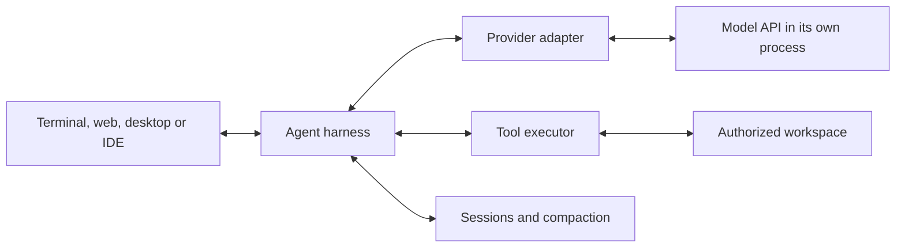

# Interfaces, harnesses and execution environments

[Documentation](../README.md) · [Architecture](../architecture.md)

The model endpoint, agent harness and visible shell are separate components. Connect them deliberately so that changing the model does not discard tools or sessions, and changing the shell does not silently replace the runtime profile.

| Component | Role | Guide |
|:--|:--|:--|
| Pi | Coding-agent harness, terminal UI, SDK and JSONL RPC | [Pi](pi.md) |
| OpenShell | Agent execution environment, lifecycle and provider/access policy | [OpenShell + Pi](openshell.md) |
| llama UI | llama-server's bundled web interface and its native tool/agent loop | [llama UI](llama-ui.md) |
| Hermes | Agent harness with CLI, web/desktop, IDE and messaging entry points | [Hermes](hermes.md) |

## Connection contract

For every client record the reachable base URL, API protocol, served model ID, authentication source, context/output limits and required capabilities. Obtain the ID from the actual server. Pi's `openai-completions` and Hermes's `chat_completions` are different client configuration values for the chat-completions API; do not copy one schema into the other.

“OpenAI compatible” is a starting protocol choice. Verify streaming, tool calls/results, system/developer roles, reasoning fields, multimodal payloads and usage accounting. Use compatibility flags only for the behavior the endpoint implements.

`127.0.0.1` means the machine/network namespace of the process making the request. For OpenShell or another container, use its documented host/service route and test from there. Keep inference loopback-bound when a scoped bridge suffices; an HTTP API does not need a public listener merely to connect a local agent.

## Custom solutions

Choose the smallest existing extension point that owns the requested change:

- A different model/endpoint: provider configuration.
- A new action: tool/extension/MCP integration in the owning harness.
- A different prompt or memory policy: the harness's documented context/extension interface.
- A new view: the UI's components and existing state/services.
- A custom app around Pi: SDK or RPC, preserving the harness's tool/session loop.
- A custom Hermes client: its documented backend or ACP boundary, preserving authentication and session ownership.

Do not implement a second tool loop just because a new frontend is needed. An external Pi/Hermes harness does not become embedded in llama UI by changing the model base URL; that requires an explicit UI-to-harness integration.

Before patching, read the versioned code map in the relevant guide, trace callers, preserve existing packages/extensions and run a nonvisual check of the changed protocol/state transition. Do not generate or update a Graphify graph unless the user requests it; the Mermaid maps here are ordinary documentation.
