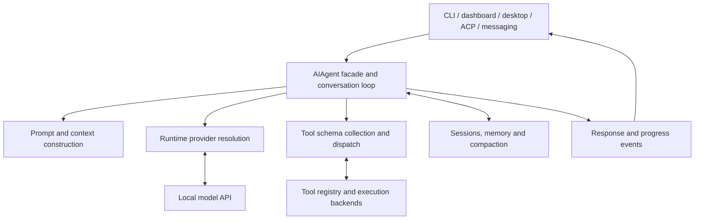

# Hermes — local models and harness customization

[Interfaces](README.md) · [Validation](../validation.md) · [Source revisions](../sources.md)

Hermes owns the agent loop, tools, sessions, memory/compaction and multiple user interfaces. The framework can connect Hermes to an independently managed local engine or use Hermes's own managed local-model path when that fits the task. Assign runtime ownership explicitly so two managers do not start, resize or replace the same server.

To reuse selected Hermes MCP servers and skill text in Bonsai's bundled UI, follow [the llama UI bridge contract](llama-ui.md#reuse-hermes-tools-and-skills). This does not move Hermes sessions or memory into llama UI. Optional typed decisions and browser-use are covered by [Jev](jev.md).

## Install and select the runtime owner

Use [NousResearch/hermes-agent](https://github.com/NousResearch/hermes-agent) and its selected release's installation instructions. The inspected `0.21.1` source requires Python `>=3.11,<3.14`; optional integrations have their own extras. For source development, use the checkout's `pyproject.toml` and lockfile in its own environment, not another engine's environment.

The managed local-model interface can install llama.cpp and select/load models. Its settings and assumptions belong to that Hermes release. For explicit LocalForgeLLM placement/context experiments, connect a custom endpoint to the independently managed server instead. See [managed local models](https://github.com/NousResearch/hermes-agent/blob/67764dc0863349a384c16425e73ee8571f3a94b7/website/docs/user-guide/local-models.md).

## Connect an existing server

Discover the real model ID first. Merge the following into the selected Hermes profile's `config.yaml` (normally under `~/.hermes/`), preserving other settings:

```yaml
model:
  provider: custom
  default: localforge-model
  base_url: http://127.0.0.1:8080/v1
  api_mode: chat_completions
  context_length: 8192
```

Use the actual reachable endpoint and effective context. `model.default` is the current saved model key. A preexisting unconfigured installation may have `model: ""`; the picker/config migration turns it into a mapping. See [model configuration](https://github.com/NousResearch/hermes-agent/blob/67764dc0863349a384c16425e73ee8571f3a94b7/website/docs/user-guide/configuring-models.md).

For a credentialless local endpoint, a fresh process can use a dummy key when the client requires one:

```bash
OPENAI_API_KEY=unused hermes
```

For an authenticated endpoint, use the configured provider's real secret reference. Do not send an unrelated cloud-provider key to a local/custom URL. The provider resolver considers explicit runtime choices, saved configuration and environment; inspect the effective selection rather than assuming an environment export overrides every saved setting. [Provider runtime resolution](https://github.com/NousResearch/hermes-agent/blob/67764dc0863349a384c16425e73ee8571f3a94b7/website/docs/developer-guide/provider-runtime.md) describes this boundary.

Use `hermes model` for the native provider/model picker, or start a fresh CLI process after editing the relevant profile. Confirm the running session uses the intended model. Changing a default does not necessarily replace the model of an already-running chat on every interface/version.

Hermes can route auxiliary tasks such as compression, vision and title generation separately. Inspect `auxiliary`, top-level fallback providers and per-task fallback chains. For a local-only task, explicitly route needed auxiliary work to compatible local endpoints and remove unintended remote fallbacks from that profile. `provider: auto` can consult fallback discovery; a local main model alone is not proof that every auxiliary request stays local. See `agent/auxiliary_client.py` and the selected release's configuration guide.

## Start the intended interface

| Surface | Command / connection |
|:--|:--|
| Terminal | `hermes` with the intended profile/provider |
| Browser dashboard | `hermes dashboard --host 127.0.0.1 --port 9119 --no-open`; user opens the printed/local URL |
| Headless backend for a custom/desktop client | `hermes serve --host 127.0.0.1 --port 9119` |
| Messaging gateway | Configure the intended platform with `hermes gateway setup`, then use its managed start procedure |
| IDE | Follow the release's ACP configuration and `acp_adapter/` contract |

These are alternative entry points, not a command sequence to start every interface. Dashboard and headless backend share the server implementation; use one owner for the same port. Messaging configuration/publication is only needed when the user requests that integration. The [dashboard/serve parser](https://github.com/NousResearch/hermes-agent/blob/67764dc0863349a384c16425e73ee8571f3a94b7/hermes_cli/subcommands/dashboard.py) confirms the inspected commands and defaults.

The framework skill can be used by asking the Hermes agent to read the checkout's `AGENTS.md`/`SKILL.md`. If registering it in Hermes's native skill system, retain the complete repository or a verified reference to its docs. Do not install a disconnected copy of the skill and assume relative references still work.

## Harness and interface code map

Paths refer to [Hermes 67764dc0](https://github.com/NousResearch/hermes-agent/tree/67764dc0863349a384c16425e73ee8571f3a94b7). Use the [upstream architecture](https://github.com/NousResearch/hermes-agent/blob/67764dc0863349a384c16425e73ee8571f3a94b7/website/docs/developer-guide/architecture.md) as the next reading entry.



| Source | Owns / change here for |
|:--|:--|
| `hermes_cli/main.py`, `cli.py` | CLI dispatch and interactive facade |
| `run_agent.py`, `agent/conversation_loop.py`, `agent/turn_*.py` | `AIAgent` facade and conversation/tool loop |
| `agent/prompt_builder.py`, `agent/context_compressor.py` | Prompt assembly and default compaction |
| `hermes_cli/runtime_provider.py`, `hermes_cli/runtime_provider_custom.py` | Provider selection and custom-endpoint resolution |
| `providers/`, `plugins/model-providers/` | Provider profiles/registration |
| `model_tools.py`, `tools/registry.py`, `tools/environments/` | Tool discovery, dispatch and execution boundary |
| `agent/auxiliary_client.py` | Side-task routing and fallback behavior |
| `hermes_state.py` and its sibling modules | Persistent session/state storage |
| `hermes_cli/web_server.py` and `hermes_cli/web_server_*.py` | Shared web/desktop backend and API handlers |
| `web/src/`, `apps/desktop/src/` | Browser and desktop UI layers |
| `gateway/`, `plugins/platforms/`, `acp_adapter/` | Messaging/platform and IDE integration boundaries |

## Customize through the owning layer

Use provider configuration for a new endpoint. Use a model-provider plugin for a new provider contract, a tool/plugin for a new action, and the existing context/memory extension points for those policies. Avoid a second independent loop that bypasses Hermes's sessions, tool dispatch or approvals.

For a custom web/desktop surface, inspect the real backend request/event contract, frontend API client and session store. Preserve authentication, active-profile selection, streaming, reconnect, cancellation and tool-result ordering. A frontend change should not alter provider precedence or overwrite another profile.

Verify configuration loading, one local-model request, one complete permitted tool cycle and the changed session/event behavior. Include required auxiliary tasks when testing local-only operation. Run targeted nonvisual checks for code changes; dashboard/browser inspection requires separate permission. Do not use a broad “stop all web servers” command to restart just one user's session.
