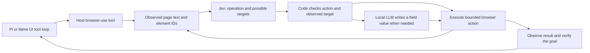

# Jev API with a local LLM and browser-use

[Interfaces](README.md) · [llama UI MCP](llama-ui.md#reuse-hermes-tools-and-skills) · [Pi](pi.md)

**Verified sources: September 18, 2026.** Jev is TypeSafe AI's hosted **System One** decision model. In this stack it chooses among structured alternatives while Bonsai or another local LLM writes text and code. It is an optional network API, not local model weights and not an OpenAI chat-completions endpoint. [TypeSafe introduction](https://docs.typesafe.ai/introduction)

## API contract

Send application state and a map of named questions to `POST https://api.typesafe.ai/v1/systemone`, authenticated with a bearer key. The response maps the same question IDs under `answers` and includes `usage`. Use the returned model identity in your records. `jev-latest` is a moving alias; the inspected model page lists **`jev-1.13.0`** for a pinned experiment. [API reference](https://docs.typesafe.ai/api), [models](https://docs.typesafe.ai/models)

| Primitive | Request | Result used by the application |
|:--|:--|:--|
| `choice` | Named options in a `criteria` map | `choice`, probability distribution and confidence |
| `score` | Ordered rubric levels in a `criteria` array | Numeric score and distribution over levels |
| `noul` | A yes/no proposition | `noul`: probability of yes, from 0 to 1; no separate confidence |

Batch independent questions in one call. Each is evaluated against the same state, independently of the other answers. If a later decision needs an earlier result, combine them in application code or make another call; the questions do not secretly share a chain of thought. [Choice](https://docs.typesafe.ai/primitives/choice), [Score](https://docs.typesafe.ai/primitives/score), [Noul](https://docs.typesafe.ai/primitives/noul)

Set `TYPESAFE_API_KEY` through the host's private environment/secret store. This example makes one paid API request when explicitly executed; it is not run by documentation checks:

```bash
curl --fail-with-body --silent --show-error --max-time 20 \
  https://api.typesafe.ai/v1/systemone \
  -H "Authorization: Bearer $TYPESAFE_API_KEY" \
  -H 'Content-Type: application/json' --data-binary @- <<'JSON'
{
  "model": "jev-1.13.0",
  "state": {
    "task": "Find the current release notes and summarize the changes.",
    "available_evidence": []
  },
  "questions": {
    "route": {
      "type": "choice",
      "instructions": "Select the next useful step given the available evidence.",
      "criteria": {
        "search": "Current external facts are required and evidence is missing.",
        "answer": "The supplied evidence is sufficient to answer.",
        "clarify": "The requested product or task is ambiguous."
      }
    },
    "supported": {
      "type": "noul",
      "instructions": "Does the supplied evidence support a current factual answer?"
    }
  }
}
JSON
```

Read `answers.route.choice`, `answers.route.probabilities` and `answers.supported.noul`. Validate response shape, finite numeric values, allowed choices and probability ranges before branching. Missing or invalid results mean **unverified**, not success. Handle timeouts, authentication failures and rate limits explicitly; record actual attempts and usage. An uncertain decision can return to the local LLM or a human. A probability threshold is an application policy to calibrate on tasks, not a universal correctness threshold.

## Upstream implementations: browser-use and Cua

These repositories provide different parts of an agent. The Jev API is authored
by **TypeSafe AI**; the browser demonstration is published by **browser-use**;
**Cua** supplies computer-control infrastructure. The following review pins
both repositories, rather than treating their moving default branches as an
installed dependency.

| Project / inspected revision | Role | LocalForgeLLM status |
|:--|:--|:--|
| [browser-use/jev-ultrafast / 452c1ad](https://github.com/browser-use/jev-ultrafast/tree/452c1ad2dd628008f1d5608f28158d76e49e6cc0) | Jev decision loop, browser observations and a text helper | Basis of the recorded host adapter; local modifications described below |
| [trycua/cua / 05f29785](https://github.com/trycua/cua/tree/05f29785b508a4441ec3aa06c556a8e8b26c1d71) | Driver, MCP/SDK, desktop sandboxes and evaluation tools | Source review and integration mapping; not installed or benchmarked in this update |

### How the browser-use implementation works

The source separates observation, decisions, field text and execution:

| Source at the pinned revision | Responsibility |
|:--|:--|
| [`snapshot.js`](https://github.com/browser-use/jev-ultrafast/blob/452c1ad2dd628008f1d5608f28158d76e49e6cc0/jev_ultrafast/snapshot.js) | Reads visible text and common HTML/ARIA controls, retaining actual DOM node identities |
| [`model.py`](https://github.com/browser-use/jev-ultrafast/blob/452c1ad2dd628008f1d5608f28158d76e49e6cc0/jev_ultrafast/model.py) | `action_space()` groups compatible targets; `choose()` batches operation and target questions; `field_text()` calls an OpenAI-compatible text model |
| [`agent.py`](https://github.com/browser-use/jev-ultrafast/blob/452c1ad2dd628008f1d5608f28158d76e49e6cc0/jev_ultrafast/agent.py) | Drives predict → act → observe, consumes each decision once and records executed actions before the next observation |
| [`browser.py`](https://github.com/browser-use/jev-ultrafast/blob/452c1ad2dd628008f1d5608f28158d76e49e6cc0/jev_ultrafast/browser.py) | Owns a background tab through Browser Harness/CDP; checks freshness, geometry, visibility and hit-testing before input |

One Jev call contains the operation plus possible `click_target`,
`type_text_target` and `select_target` questions. Only the selected operation's
target can execute. The validator requires a known choice, the complete allowed
probability map, finite values in range, a near-unit sum and a maximum-probability
choice. The field helper runs only for `TYPE_TEXT`; invalid or missing field
text stops execution. The upstream helper defaults and demo configuration name
hosted models; replacing it with Bonsai is our adaptation. [Decision and text code](https://github.com/browser-use/jev-ultrafast/blob/452c1ad2dd628008f1d5608f28158d76e49e6cc0/jev_ultrafast/model.py)

The loop reobserves a stale page instead of executing an old decision. It checks
freshness again after text generation, stops on uncertain native-select results
and blocks after three unchanged non-wait actions. Its upstream budgets are 60
actions and 120 decisions; our host adapter uses tighter limits. The generic
loop accepts a `DONE` decision, while the Flights example separately checks the
actual outcome. Do not confuse those two checks. [Agent](https://github.com/browser-use/jev-ultrafast/blob/452c1ad2dd628008f1d5608f28158d76e49e6cc0/jev_ultrafast/agent.py), [budgets](https://github.com/browser-use/jev-ultrafast/blob/452c1ad2dd628008f1d5608f28158d76e49e6cc0/jev_ultrafast/questions.py), [Flights verifier](https://github.com/browser-use/jev-ultrafast/blob/452c1ad2dd628008f1d5608f28158d76e49e6cc0/examples/flights.py)

The author's matched Flights report has three alternating pairs: median task
time **9.450 → 7.092 s**, Jev requests **22 → 17**, browser protocol calls
**1,092 → 101**. It attributes the improvement to fewer observation round trips,
more selective freshness checks and short waits for autocomplete. Both arms
used Jev 1.13.0 and Mercury 2.5; this is **not a Bonsai benchmark**. Timing starts
after the initial observation and ends at accepted `DONE`, excluding setup,
initial navigation and independent post-run verification. The separate video
run's 178 ms median Jev latency is not full browser-task latency. Three pairs
do not establish a broad speed advantage. [Author's measurements and limits](https://github.com/browser-use/jev-ultrafast/blob/452c1ad2dd628008f1d5608f28158d76e49e6cc0/docs/performance.md)

### Where Cua fits

[Cua Driver](https://github.com/trycua/cua/blob/05f29785b508a4441ec3aa06c556a8e8b26c1d71/libs/cua-driver/README.md)
exposes `cua-driver mcp` to agents and native Python/TypeScript SDKs to
applications. These are execution/observation interfaces. The inspected browser
driver path does not implement the Jev decision policy; a Jev adapter must
connect the two explicitly. Cua Fleets and local VM tooling are separate
deployment options, not prerequisites for using Jev with our existing browser
adapter. [Project overview](https://github.com/trycua/cua/blob/05f29785b508a4441ec3aa06c556a8e8b26c1d71/README.md)

The relevant Linux browser path is concrete:

1. Bind an operator-approved browser window with `get_browser_state`, retaining
   its session, `target_id` and `tab_id`. Missing browser setup is reported as a
   refusal; `browser_prepare` is a separate operation.
2. Request the bound tab with `snapshot_format="semantic_v2"` and
   `include_screenshot=false`. Serialize the returned textual state and only
   compatible action refs into Jev questions. Jev's current text API cannot
   consume a screenshot as visual input.
3. Map the chosen ref to `browser_click` or `browser_type`; for field replacement
   supply the locally generated text and `replace=true`. Preserve the same
   session/target/tab identity on every call.
4. Read the new state and verify the requested outcome. A stale ref requires a
   new observation and decision; it must not be recycled into another snapshot.

This is an **integration design**, not a Cua/Jev run performed here. The pinned
[Linux tool contract](https://github.com/trycua/cua/blob/05f29785b508a4441ec3aa06c556a8e8b26c1d71/docs/content/docs/reference/cua-driver/mcp-tools-linux.mdx)
and [`browser/tools.rs`](https://github.com/trycua/cua/blob/05f29785b508a4441ec3aa06c556a8e8b26c1d71/libs/cua-driver/rust/crates/cua-driver-core/src/browser/tools.rs)
define those calls. In
[`browser/engine.rs`](https://github.com/trycua/cua/blob/05f29785b508a4441ec3aa06c556a8e8b26c1d71/libs/cua-driver/rust/crates/cua-driver-core/src/browser/engine.rs),
mutations revalidate the exact browser binding and connection generation; a new
tab snapshot supersedes previous refs. Driver permissions and platform support
still govern execution. Registering MCP alone does not authorize attachment to
a logged-in browser profile.

For this stack, retain the working browser-use adapter. Consider Cua when a task
requires native applications or its richer browser state. Expose a selected tool
subset and bounded observations: the current 47-tool setup already consumes
about 11K prompt tokens. Cua's optional screenshots, desktop capture and native
app support would require their own local validation and memory/latency records.

## Our browser-use adapter: Jev selects, the local model writes

Our integration follows [browser-use/jev-ultrafast at 452c1ad](https://github.com/browser-use/jev-ultrafast/tree/452c1ad2dd628008f1d5608f28158d76e49e6cc0), adapted to the existing local harness:



The browser controller collects an element table. Jev selects an operation and speculative target questions in a single request; code consumes only the answer appropriate to that operation. Free-form input text is generated by the local LLM, with thinking disabled and a strict `{"text": "..."}` response. The model does not invent CSS selectors or execute arbitrary JavaScript.

The recorded host adapter accepts `{url, goal, max_steps?}` and two fixed text profiles: `ornith` on port 8080 and `bonsai` on port 8081. Pi retains its selected default; the llama UI MCP adapter explicitly selects Bonsai. Arbitrary model endpoints are not accepted from the model. On another machine, configure the operator-owned profile mapping rather than copying private host paths.

| Boundary | Recorded implementation |
|:--|:--|
| Browser | Isolated temporary Chrome profile; separate from the user's logged-in browser |
| Actions | Click, type, select, scroll, wait, done or blocked, using observed elements |
| Limits | 12 steps by default, maximum 24; 240 seconds; one browser job at a time |
| Networking | Public HTTP(S) start URLs by default; localhost is an explicit operator setting |
| Local text helper | OpenAI-compatible chat API; validated field text; no TypeSafe key in the model prompt |
| Completion | Page text, history and an independent goal check; `DONE` alone is not evidence |
| Cancellation | Stops the job's own browser process group |

The MVP has incomplete iframe, shadow-DOM, upload, popup and nested-scroll support. Initial URL filtering is not a complete network sandbox. Existing harness permissions still govern actions; a Jev score must not grant new authority or automatically retry a side effect.

The upstream client retries selected provider HTTP errors up to three attempts.
Our host adaptation removes that implicit retry loop and records actual calls;
retry policy belongs to the host. It also replaces the Browser Harness
connection with an isolated owned browser transport, adds cancellation and
fixed local text profiles, and explicitly disables llama.cpp thinking for field
text. These are local adapter changes, not features claimed for an unmodified
upstream checkout.

## Pi, Hermes skills and llama UI

The existing Pi integration has two extensions: a browser-use tool and a research controller. The controller checks whether research is needed, tool results and the final answer, with at most two correction rounds. It supports correction, observation and off modes. Tavily supplies primary search/fetch, with Exa as the configured fallback. Keys and network access stay in a host service reached through a Unix socket; the Pi container remains without direct networking. This is a recorded installation, not a service installed by cloning LocalForgeLLM.

For llama UI, expose the existing host tool through native server MCP and adapt the selected Hermes MCP servers and skill reader. The [MCP guide](llama-ui.md#reuse-hermes-tools-and-skills) describes the boundary: tools and skill text can be reused, while Hermes sessions/memory and Pi lifecycle hooks do not migrate automatically. Our native loop verified a skill lookup/read cycle and Bonsai field-text generation; it did **not** verify a paid Jev browser task during that integration check.

On a new deployment, validate in this order: offline response/filter checks; host connectivity without paid inference; a local model tool-result cycle; then one explicitly authorized live Jev/browser task with elapsed time, API usage and observed outcome. Keep tool-schema input tokens separate from model decode speed: the recorded 47-tool MCP setup consumed about **11K input tokens** before a short task, a substantial share of a 32K context. Enable only the required tools and load skill bodies on demand.

If the application already uses LangChain, its [official Jev integration](https://www.langchain.com/blog/building-a-harness-with-jev) exposes `TypeSafeClassifier`. A direct HTTP call is sufficient for this stack; LangChain is not an additional prerequisite.

## Speed, pricing and correctness claims

TypeSafe's [September 15 launch article](https://typesafe.ai/blog/introducing-system-one-models-and-jev) reports **70–500 ms** latency and **40–200×** speed differences on selected decision tasks. It identifies geographic and benchmark-design qualifications. These are vendor results, not our browser completion times; navigation, local text generation, tool execution and verification add latency.

The inspected [model page](https://docs.typesafe.ai/models) lists **$0.042 per million input tokens**; the launch article states output tokens are free. Record actual `usage` and check current account pricing before a new run. More questions still add input cost. The model page lists text input only and a 64K total request limit with a 32K limit for state plus the longest question; this is independent of the local LLM's context.

Typed output constrains the result's structure and available choices. It does **not** guarantee that the selected action or factual judgment is correct. TypeSafe itself documents [known model weaknesses](https://docs.typesafe.ai/model-jaggedness/jev-1.13). We therefore describe schema guarantees separately from task success and retain independent outcome checks.
