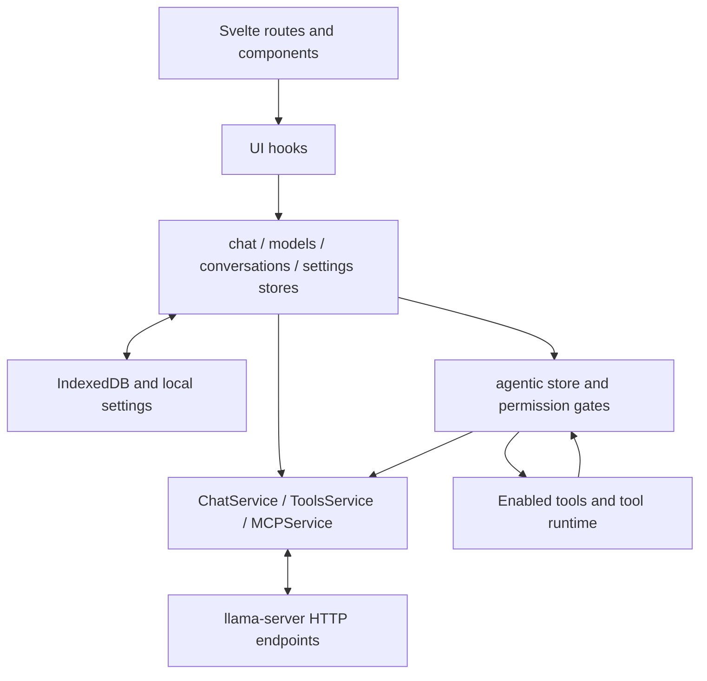

# llama UI — bundled chat, tools and custom frontend

[Interfaces](README.md) · [Source revisions](../sources.md)

This guide refers to the SvelteKit UI in llama.cpp's `tools/ui/`, served by llama-server. It is different from Open WebUI or a Pi/Hermes frontend. The installed binary's bundled UI can be older than the current source map below.

## Start and connect

Start the selected [llama.cpp profile](../llm/install.md#start-a-baseline-and-connect-it). With the default UI enabled and a loopback bind on port 8080, the user opens `http://localhost:8080`. No Node.js installation is needed to use the UI already bundled in the server binary.

The normal single-model mode uses the loaded model. Router mode manages multiple models through the server's documented model-directory/preset configuration. Check model loading/unloading and memory limits before using it; a model picker does not imply that all listed models fit in memory simultaneously.

An external Pi or Hermes client connects to `/v1` using its own harness. It does not inherit this UI's conversations, tools or approvals. Choose which component owns the session before building a custom integration.

## Native agent and tool capability

The inspected server exposes selected built-in tools through `--tools`, execution-environment selection through `--tools-runtime`, and server MCP configuration through `--mcp-servers-config`. Tools and the MCP proxy are optional; their presence and exact names must be checked in the installed binary. A minimal selection might include `get_info` and a workspace read tool before enabling requested write/shell operations. See [server tools](https://github.com/ggml-org/llama.cpp/blob/41fc7584f0c1d72d9cc1ac46ccae8defc1587f0f/tools/server/README.md#server-tools).

Tool execution otherwise uses the server's environment. Select an appropriate container/SSH runtime and workspace when the task needs isolation; this is separate from where model inference runs. MCP child processes also need an understood execution boundary. Preserve the tool permission/confirmation behavior when customizing the UI.

In the UI, the tool registry and agentic loop select enabled tools, handle model tool calls and feed results into continuation. Check a real tool cycle, not just the presence of a tools panel. For browser-direct MCP, CORS/transport differs from server-managed MCP; do not enable the server's CORS proxy as a universal networking fix.

## Code and data flow

Paths refer to [llama.cpp 41fc7584](https://github.com/ggml-org/llama.cpp/tree/41fc7584f0c1d72d9cc1ac46ccae8defc1587f0f). The [upstream UI architecture](https://github.com/ggml-org/llama.cpp/blob/41fc7584f0c1d72d9cc1ac46ccae8defc1587f0f/tools/ui/README.md) and `tools/ui/docs/` contain further diagrams.



| Source | Owns / change here for |
|:--|:--|
| `tools/ui/src/routes/`, `tools/ui/src/lib/components/` | Navigation, screens and visible controls |
| `tools/ui/src/lib/hooks/` | Reusable interaction behavior |
| `tools/ui/src/lib/stores/chat/` | Chat flow, streaming, processing and context statistics |
| `tools/ui/src/lib/stores/agentic/` | Tool continuation and gates |
| `tools/ui/src/lib/stores/tools.svelte.ts`, `tools/ui/src/lib/stores/permissions.svelte.ts` | Tool selection and permission state |
| `tools/ui/src/lib/services/chat.service.ts`, `tools/ui/src/lib/services/tools.service.ts`, `tools/ui/src/lib/services/mcp.service.ts` | API and tool/MCP transport |
| `tools/ui/src/lib/stores/conversations/` | Persistent conversation state; follow its database service for storage changes |
| `tools/server/server-http.cpp`, `tools/server/server-context.cpp`, `tools/server/server-chat.cpp` | HTTP boundary, inference state and chat handling |
| `tools/server/server-tools.cpp`, `tools/server/server-mcp.cpp` | Built-in and MCP tool execution |

## Develop a custom view or integration

Use a pinned source checkout and the Node version required by its lockfile/toolchain. From `tools/ui/`, install its existing dependencies. To run only Vite on loopback against the chosen server:

```bash
npm ci
VITE_PUBLIC_SERVER_ORIGIN=http://127.0.0.1:8080 \
  npm exec -- vite dev --host 127.0.0.1
```

This is a development command for an authorized UI task. The checked [Vite configuration](https://github.com/ggml-org/llama.cpp/blob/41fc7584f0c1d72d9cc1ac46ccae8defc1587f0f/tools/ui/vite.config.ts) reads `VITE_PUBLIC_SERVER_ORIGIN` and proxies API routes. The upstream `npm run dev` wrapper additionally starts Storybook and performs Git-hook setup, so inspect it before choosing that broader workflow.

For a frontend change, reuse the existing store/service owning the feature. For embedding Pi/Hermes, implement the requested harness bridge at the service/session boundary and preserve streaming, tool events, cancellation, session identity and permissions. A base-URL change alone cannot translate a harness RPC protocol into model chat completions.

Use the existing nonvisual checks appropriate to a code change:

```bash
npm run check
npm run lint
npm run build
```

The inspected `npm test` also includes browser suites, so select tests deliberately. The build emits `build/tools/ui/dist/` relative to the llama.cpp root. Serve it through the supported static-path option or rebuild llama-server to embed it, then verify the chosen distribution. UI inspection and screenshots are separate, explicitly authorized checks.
