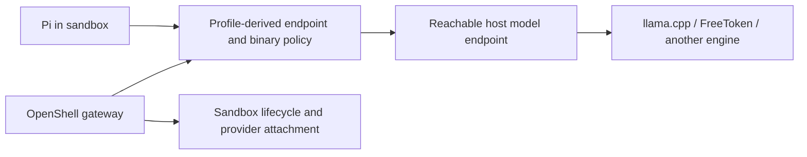

# OpenShell + Pi

[Interfaces](README.md) · [Pi configuration](pi.md) · [Source revisions](../sources.md)

OpenShell supplies the execution environment and access policy for an agent. Pi supplies the coding harness. The model can run separately on the host, using its CPU/GPU without passing those devices into the Pi sandbox.

## Identify the installed architecture first

Our working integration was checked with OpenShell **0.0.110**, Pi **0.84.2**, rootless Podman and llama.cpp **b10883**. It uses the legacy managed inference route. The inspected upstream commit **a0814443** has removed that route and the `openshell inference` commands. These configurations must not be mixed.

```bash
openshell --version
openshell --help
openshell provider --help
openshell sandbox --help
```

Inspect the gateway/supervisor versions too; a CLI binary alone does not identify every running component. Choose the documentation matching the installed release. See [the upstream migration](https://github.com/NVIDIA/OpenShell/blob/a0814443f19c07102b19ff09d6ead3d3ba59f9c5/docs/sandboxes/inference-routing.mdx).

## Install the environment

Use the selected OpenShell release's native CLI installation and [compute-driver instructions](https://github.com/NVIDIA/OpenShell/blob/a0814443f19c07102b19ff09d6ead3d3ba59f9c5/docs/about/installation.mdx). In the inspected current source, the PyPI `openshell` package supplies the Python SDK and does not install the CLI. Choose Docker, rootless Podman or another supported driver according to the machine; preserve an existing gateway and policy.

Record the gateway endpoint/name, its service owner, compute driver, sandbox image digest, workspace volume and agent configuration location. Pi can use the official community image selected by `--from pi`, or an existing custom image. Build a custom Containerfile with the container runtime first: current `--from` accepts an image/rootfs source, not a Dockerfile build instruction. Install Pi's dependencies and intended extensions in the image when runtime downloads are unavailable. [Sandbox lifecycle and image sources](https://github.com/NVIDIA/OpenShell/blob/a0814443f19c07102b19ff09d6ead3d3ba59f9c5/docs/sandboxes/manage-sandboxes.mdx) define the current behavior.

The model service and OpenShell gateway must use different ports. Do not copy a gateway example's port 8080 onto a host where llama-server already owns 8080.

## Current upstream — native endpoint and provider attachment



First establish a model endpoint reachable from the sandbox supervisor and workload. `host.openshell.internal` resolves to the host according to the compute driver; the service must be reachable at that address. It does not universally make a host loopback listener reachable. Use a scoped bridge or appropriate private bind when needed and verify it from the actual environment.

For a credentialless service reachable at `host.openshell.internal:18080`, save an explicit profile such as `localforge-provider.yaml`. Replace the port and binary paths with those actually used; the Node paths matter because Pi performs requests through Node:

```yaml
id: localforge-model-api
display_name: LocalForge model API
description: Local model endpoint for the selected agent sandbox
category: inference
inference_capable: true
credentials: []
endpoints:
  - host: host.openshell.internal
    port: 18080
    protocol: rest
    access: read-write
    enforcement: enforce
binaries:
  - /usr/bin/node
  - /usr/local/bin/node
  - /usr/bin/curl
  - /usr/local/bin/curl
```

This follows the source's [self-hosted endpoint profile](https://github.com/NVIDIA/OpenShell/blob/a0814443f19c07102b19ff09d6ead3d3ba59f9c5/docs/sandboxes/inference-routing.mdx). Authenticated endpoints additionally need endpoint-bound credential definitions and a real credential source; do not reuse a public OpenAI provider profile for an unrelated host.

For a new profile/provider/sandbox, use distinct names:

```bash
openshell provider profile lint -f localforge-provider.yaml
openshell provider profile import -f localforge-provider.yaml
openshell provider create --name localforge-local --type localforge-model-api
openshell sandbox create --name localforge-pi --from pi \
  --provider localforge-local -- bash
```

For an existing sandbox, attach the intended provider with `openshell sandbox provider attach SANDBOX localforge-local`. Existing custom profiles are updated with `provider profile update`, not re-imported. Preserve other attachments and the sandbox's filesystem policy.

Inside the sandbox, merge the [Pi provider](pi.md#install-and-configure) using `baseUrl: "http://host.openshell.internal:18080/v1"`, the real served model ID and the effective context. The workload now owns the model selection, request shape and timeout. `inference.local` is not used on this route.

Inspect and test before starting the agent:

```bash
openshell sandbox provider list localforge-pi
openshell policy get localforge-pi --full
openshell sandbox exec localforge-pi -- curl --fail --silent --show-error \
  http://host.openshell.internal:18080/v1/models
openshell sandbox connect localforge-pi
```

Launch Pi from the connected shell using its configured provider/model. Transfer the LocalForgeLLM checkout and task files through the installed version's supported workspace/upload mechanism, or an already-authorized mount. Keep the complete repository with `SKILL.md` and `docs/`. Recheck allowed paths and binary attribution; do not fix a denied request by enabling unrestricted networking or mounting the entire host home directory.

## Legacy 0.0.110 — our working reference


In this version, a provider contains the upstream endpoint and the managed route chooses provider/model. Pi's provider uses `https://inference.local/v1`. Our saved setup uses `qwen-local`, model alias `qwen-apex`, server context 32768 and Pi output limit 2048. These identities are examples, not mandatory framework names.

For a new legacy route, the installed `0.0.110` CLI supports:

```bash
openshell provider create --name localforge-local --type openai \
  --credential OPENAI_API_KEY=unused \
  --config OPENAI_BASE_URL=http://host.openshell.internal:18080/v1
openshell inference set --provider localforge-local \
  --model localforge-model --timeout 600
```

The managed route is shared at workspace scope. Inspect the existing route and its consumers before replacing it. The CLI's endpoint check and the supervisor's network environment may resolve addresses differently. In our installation, the host did not resolve `host.openshell.internal`, while the supervisor could reach the scoped relay. Verify the actual sandbox request; do not infer failure or success solely from host curl. If endpoint verification needs special handling, use only a documented, scoped option in the installed CLI and retain an end-to-end request check.

Our rootless Podman/pasta setup also needed separate gateway-callback and model-inference relays because of host routing/VPN behavior. This is a machine-specific network workaround, not a prerequisite for every OpenShell deployment. Reproduce it only after identifying the same reachability issue; keep the model listener and allowed source scope narrow.

## Code map and custom integration

At [the current source snapshot](https://github.com/NVIDIA/OpenShell/tree/a0814443f19c07102b19ff09d6ead3d3ba59f9c5):

| Source | Owns / inspect for |
|:--|:--|
| `crates/openshell-cli/src/commands/` | CLI request construction, provider and sandbox commands |
| `crates/openshell-server/src/grpc/provider.rs`, `crates/openshell-server/src/grpc/sandbox.rs` | Gateway provider/sandbox API handlers |
| `crates/openshell-server/src/provider_refresh.rs` | Credential refresh lifecycle |
| `crates/openshell-sandbox/src/lib.rs` | Supervisor startup and orchestration |
| `crates/openshell-supervisor-network/` | Policy/proxy and endpoint access behavior |
| `crates/openshell-supervisor-process/` | Agent process execution and enforcement |
| `providers/`, `docs/providers/` | Provider profile definitions and contract |
| `architecture/gateway.md`, `architecture/sandbox.md` | Control/data-plane relationships |

For a custom model connection, start with profile/client configuration. For a custom tool or UI, use Pi's extension/SDK/RPC boundary. Modify OpenShell itself only when the requested feature belongs to its lifecycle, policy or transport layer.

## Updates and verification

Preserve the persistent workspace, sessions, packages and credentials by reference. A current-upstream migration from legacy routes changes DNS/trust and supervisor state and can require sandbox replacement. Back up/export state and prove the new route in a separate sandbox before any deletion. Stopping an agent, disconnecting the terminal and deleting a sandbox are different operations.

Acceptance requires model discovery and a tool-call cycle from the actual sandbox, the intended client context/timeout, and working restart/reconnect behavior. Record the verified CLI, gateway, supervisor and image versions together.
