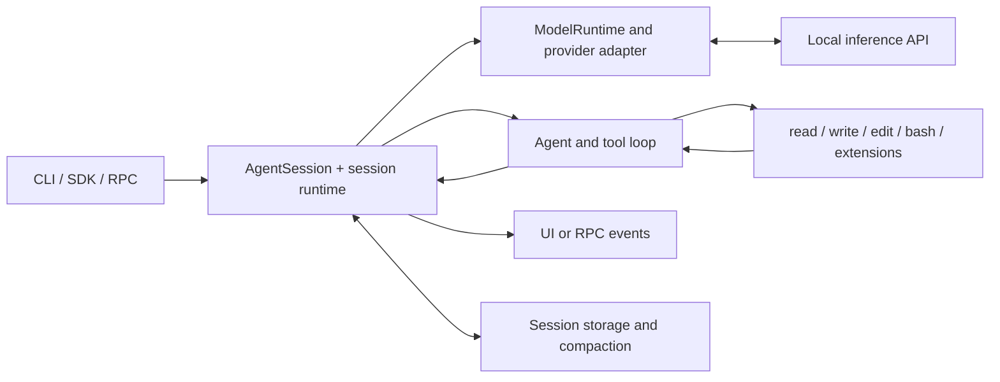

# Pi — local model connection and harness map

[Interfaces](README.md) · [OpenShell + Pi](openshell.md) · [Source revisions](../sources.md)

Pi owns the coding-agent loop, tools, history, compaction and terminal interaction. Inference can run independently through llama.cpp, FreeToken or another compatible server.

## Install and configure

The upstream repository is now [earendil-works/pi](https://github.com/earendil-works/pi); the older `badlogic/pi-mono` URL redirects there. The package is `@earendil-works/pi-coding-agent`. Inspect the selected version's Node requirements and preserve an existing installation's packages/extensions.

For a new installation, select and record `PI_VERSION` before installing:

```bash
npm install -g "@earendil-works/pi-coding-agent@$PI_VERSION"
pi --version
```

Merge a provider into `~/.pi/agent/models.json` rather than replacing the whole file. `PI_CODING_AGENT_DIR` can relocate this directory. This initial text-only example assumes a server exposing `localforge-model` with an effective 8192-token window:

```json
{
  "providers": {
    "localforge": {
      "baseUrl": "http://127.0.0.1:8080/v1",
      "api": "openai-completions",
      "apiKey": "unused",
      "compat": {
        "supportsStore": false,
        "supportsDeveloperRole": false,
        "supportsReasoningEffort": false,
        "maxTokensField": "max_tokens"
      },
      "models": [{
        "id": "localforge-model",
        "name": "LocalForge model",
        "reasoning": false,
        "input": ["text"],
        "contextWindow": 8192,
        "maxTokens": 2048,
        "cost": {"input": 0, "output": 0, "cacheRead": 0, "cacheWrite": 0}
      }]
    }
  }
}
```

`unused` is a dummy value only for a credentialless local server. For an authenticated endpoint, use Pi's supported credential mechanism. Set capabilities from the actual model/server: add image input only with a working vision path; configure reasoning serialization only when supported. For local Qwen templates, the inspected client supports `thinkingFormat: "qwen-chat-template"`; that choice is not universal. See [models and compatibility](https://github.com/earendil-works/pi/blob/4bd3f48df0b14c82e8df2640645e94f82f125f44/packages/coding-agent/docs/models.md).

To run from the LocalForgeLLM checkout:

```bash
pi --list-models localforge-model
pi --skill ./SKILL.md --provider localforge --model localforge-model
```

Pi also loads applicable `AGENTS.md` context files. Explicit `--skill` makes this repository's skill available without copying it away from its documentation. Inspect existing context and skills if behavior is unexpected. [Skill discovery](https://github.com/earendil-works/pi/blob/4bd3f48df0b14c82e8df2640645e94f82f125f44/packages/coding-agent/docs/skills.md) describes its native rules.

Align `settings.json` compaction reserves with the server window and output allowance. The inspected Pi defaults reserve 16384 tokens and retain 20000 recent tokens; those defaults exceed this example's 8192-token window. In versions supporting per-model overrides, merge this starting configuration into the selected agent's settings:

```json
{
  "compaction": {
    "enabled": true,
    "modelOverrides": {
      "localforge/localforge-model": {
        "reserveTokens": 2048,
        "keepRecentTokens": 2048
      }
    }
  }
}
```

The override key is the exact Pi provider/model ID. Keep enough room for instructions, tool results and the compaction request, then validate a long session; a large tool schema or workload may require a larger window. Older versions without `modelOverrides` need the ordinary compaction fields in the intended isolated agent/project settings. Branch summaries use the separate `branchSummary.reserveTokens` setting; size that budget too when the workflow uses them. See [settings and compaction](https://github.com/earendil-works/pi/blob/4bd3f48df0b14c82e8df2640645e94f82f125f44/packages/coding-agent/docs/settings.md#compaction).

Our earlier 32K Qwen profile used a 2048-token response limit, but this is a measured setup's choice, not a framework requirement. A cumulative token meter can exceed the window across multiple requests.

For OpenShell, change `baseUrl` according to [the installed OpenShell architecture](openshell.md) and test the route inside the sandbox.

## Code and call flow

Paths below refer to [the inspected Pi checkout](https://github.com/earendil-works/pi/tree/4bd3f48df0b14c82e8df2640645e94f82f125f44). Follow the imports in the installed version before modifying it.

| Source | Owns / when to edit |
|:--|:--|
| `packages/coding-agent/src/core/sdk.ts` | `createAgentSession`; constructing a programmatic client |
| `packages/coding-agent/src/core/agent-session.ts` | Agent-session behavior, prompt execution, model state and events |
| `packages/coding-agent/src/core/agent-session-runtime.ts` | Session replacement/resume/fork and rebuilding cwd-bound state |
| `packages/coding-agent/src/core/model-runtime.ts`, `packages/coding-agent/src/core/model-registry.ts` | Provider/model resources and custom-model discovery |
| `packages/agent/src/agent.ts`, `packages/agent/src/agent-loop.ts`, `packages/agent/src/harness/` | Agent primitives and the harness implementation; trace the selected caller rather than assuming all entry points use one loop |
| `packages/ai/src/` | Provider serialization, streaming and model API types |
| `packages/coding-agent/src/core/extensions/`, `packages/coding-agent/src/core/tools/` | Extension events and coding tools |
| `packages/coding-agent/src/modes/rpc/` | RPC command dispatch, client and JSONL framing |
| `packages/tui/`, `packages/coding-agent/src/modes/interactive/` | Terminal widgets and interactive behavior |



## Build a custom shell

Use an [extension](https://github.com/earendil-works/pi/blob/4bd3f48df0b14c82e8df2640645e94f82f125f44/packages/coding-agent/docs/extensions.md) for a command, tool, event hook or native UI addition. Use the [SDK](https://github.com/earendil-works/pi/blob/4bd3f48df0b14c82e8df2640645e94f82f125f44/packages/coding-agent/docs/sdk.md) to embed the existing session in a Node/TypeScript application. Prefer these over editing the installed global prompt or forking the whole harness for a provider URL.

For another language or process boundary, start `pi --mode rpc --provider localforge --model localforge-model`. Send newline-delimited JSON to stdin, for example:

```json
{"id":"request-1","type":"prompt","message":"Read SKILL.md and inspect this stack's saved profile."}
```

The RPC response acknowledges acceptance; it does not mean the task finished. Consume the subsequent events, correlate IDs, handle errors/cancellation, and preserve session identity. Split frames on LF, not on all Unicode line separators. During an active response, use the documented `steer` or `followUp` behavior. See [the RPC contract](https://github.com/earendil-works/pi/blob/4bd3f48df0b14c82e8df2640645e94f82f125f44/packages/coding-agent/docs/rpc.md).

Validate a custom integration with a disposable-workspace tool cycle, streamed output, cancellation and session resumption. Keep UI screenshots/window tests separate and only run them when authorized.
